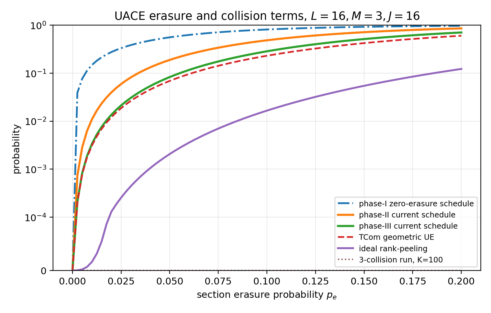
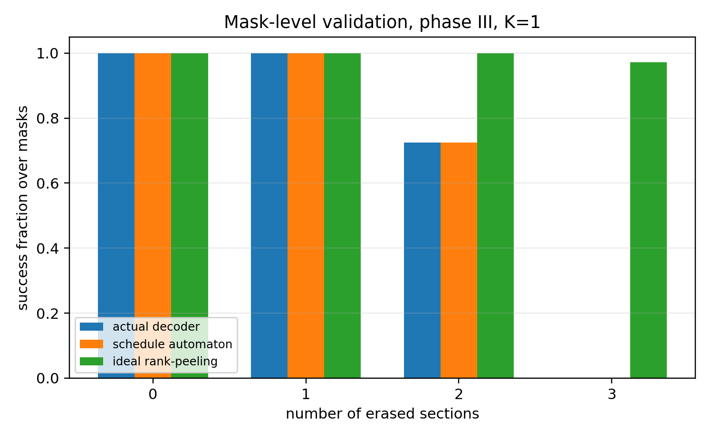
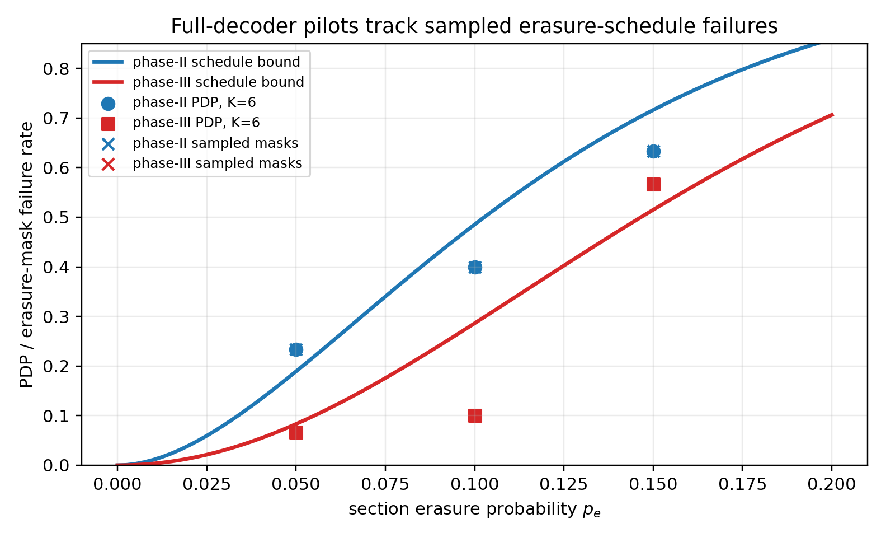

# Linked-Loop Code UACE Re-Analysis: Toward a Tighter PDP/PHP Bound

Date: 2026-06-21

This note is the first-round research deliverable for revisiting the linked-loop code (LLC) over the unsourced A-channel with erasures (UACE).  The main output is a mathematically explicit, simulation-correlated erasure bound for the current LLC decoder, plus a cleaner ideal rank-peeling bound that exposes how much headroom remains in the code itself.

## Executive Position

LLC is still worth studying, but the claim should be framed narrowly.  It is best viewed as an erasure-resilient outer code for the unsourced A/B-channel abstraction, not as a replacement for every modern unsourced random access (URA) physical-layer architecture.

The closest comparison class is outer disambiguation under A-channel-like section lists: tree codes, list-recoverable/t-tree variants, and possibly outer LDPC/BP disambiguation.  The broader CCS + AMP/BP, fading, MIMO, ODMA, sparse IDMA, blind detection, and integrated sensing lines solve larger end-to-end URA problems and should be treated as context rather than one-to-one LLC competitors.

The new technical lesson from this round is sharp: for the published/repo UACE settings `B=128`, `J=16`, `L=16`, `M=3`, the tested phase-II PDP trend is erasure-schedule failure, not A-channel symbol collision.  Phase III needs a more careful path-order analysis, because low-identity path-switch profiles can satisfy final parity much more easily than an independent-symbol model suggests.  A useful first decomposition is therefore

```text
PDP <= P_schedule + P_path,
```

where `P_schedule` is an exact finite-mask probability under the decoder's root/erasure schedule, and `P_path` contains symbol collisions, wrong path switches, parity collisions, hallucinations, and SIC propagation.  In the benchmark `K=100,J=16` regime, the exact three-section collision-run term is about `4e-8` at `p_e=0.1`, while `P_schedule` is around `0.286` for the current phase-III decoder.

## Survey Baseline

The EUSIPCO LLC paper defines UACE as a set-valued unsourced A-channel with i.i.d. erasures and introduces the tail-biting LLC parity rule, where each section is linked to the previous `M` sections so erased symbols can be reconstructed from nearby parities ([LLC UACE arXiv](https://arxiv.org/abs/2312.02160)).  The ICASSP extension moves from UACE to UBCE, where the output is a multiset and symbol multiplicities are preserved ([LLC UBCE/eLLC arXiv](https://arxiv.org/abs/2406.08767)).  The TCom 2025 paper is the most complete published LLC version ([DOI record](https://doi.org/10.1109/TCOMM.2025.3604325)).

The finite-blocklength A-channel paper gives the right converse/achievability background for the A-channel abstraction, but not an LLC decoder analysis ([Lancho-Fengler-Polyanskiy](https://arxiv.org/abs/2210.01951)).  The CCS + AMP/BP line shows how outer tree constraints can be integrated with inner AMP through belief propagation, but it targets a larger noisy compressed-sensing architecture rather than an erasure-only A-channel outer code ([Amalladinne et al.](https://arxiv.org/abs/2010.04364)).  List-recoverable CCS is the most direct warning sign for LLC: replacing a tree code with a list-recoverable outer code can produce large performance gains, at the cost of different decoding assumptions and complexity ([Andreev-Rybin-Frolov](https://arxiv.org/abs/2201.07695)).  The 2025 URA survey maps the larger space across GMAC, fading, and MIMO settings and reinforces why LLC should be positioned as an outer-code analysis problem rather than a universal URA scheme ([URA survey](https://arxiv.org/abs/2409.14911)).

Verdict: the re-analysis is meaningful if the target is a tight finite-length outer-code theory for UACE/UBCE.  It is not meaningful if framed as a broad claim that LLC dominates modern URA physical layers.

## UACE Model

Let there be `K` active users, `L` sections, section alphabet size

```text
Q = 2^J,
```

and per-section erasure probability `p_e`.  For a tagged user, define the erasure mask

```text
E = (E_0, ..., E_{L-1}) in {0,1}^L,
```

where `E_l = 1` means section `l` is erased.  For a concrete mask `e`,

```text
Pr[E=e] = p_e^{|e|}(1-p_e)^{L-|e|}.
```

Each LLC section has information length `m_l` and parity length `p_l`, with

```text
m_l + p_l = J.
```

For the current TCom/repo benchmark used here,

```text
B = 128,  J = 16,  L = 16,  M = 3,  m_l = p_l = 8.
```

## Exact Occupancy Term

Conditioned on the tagged user's section not being erased, the number of other non-erased users colliding with the tagged section symbol is

```text
C_l ~ Binomial(K-1, (1-p_e)/2^J).
```

Hence the exact tagged collision probability is

```text
rho_A(K,J,p_e)
  = Pr[C_l >= 1]
  = 1 - (1 - (1-p_e)/2^J)^{K-1}.
```

The full multiplicity law is

```text
Pr[C_l=c]
  = binom(K-1,c)((1-p_e)/2^J)^c
    (1-(1-p_e)/2^J)^{K-1-c}.
```

This replaces the rough `K 2^{-J}` approximation.  For run events in a tail-biting code, use the exact circular run probability

```text
R_circ(L,M,rho)
  = Pr[a circular length-L Bernoulli(rho) sequence has an M-run].
```

For `L<=16`, this is exactly computable by summing all masks.  Equivalently, one can use a transfer matrix over `(M-1)`-bit suffix states and subtract the no-run trace from one.  With `K=100,J=16,L=16,M=3,p_e=0.1`,

```text
R_circ(16,3,rho_A) = 4.007e-8.
```

That term is far below the observed PDP scale, so collision-runs should be retained as a correction, not treated as the leading event.

## Current Phase-II Bound

The current phase-II decoder allows one `NaN`/erasure in a candidate path and uses roots 0 and 8 for `L=16`.

In the collision-free abstraction, phase II succeeds if and only if the tagged mask has zero or one erased section.  Thus the exact phase-II schedule-failure event is

```text
B_II = {e : |e| >= 2}.
```

Therefore

```text
P_schedule,II
  = Pr[|E| >= 2]
  = 1 - (1-p_e)^L - L p_e (1-p_e)^{L-1}.
```

The useful bound is

```text
PDP_II <= P_schedule,II + P_path,II.
```

At `L=16,p_e=0.1`,

```text
P_schedule,II = 0.485272.
```

This bound is tight for the current implementation in erasure-only tests: for `K=1`, all masks of weight 0 and 1 are decoded, and all masks of weight 2 are not decoded by phase II.

## Current Phase-III Schedule Bound

The phase-III schedule adds attempts with two allowed `NaN` entries and roots 0, 6, and 10.  The actual schedule is not the same as ideal LLC rank-peeling.  It is constrained by:

- selected roots;
- the rotated scan order;
- the rule that a new `NaN` can be carried only when previous carried `NaN`s are already known;
- the first visible saver block used by `solveInfoBack` in the `L=16,M=3` profile;
- the fact that the current recovery routine does not use `dictLostInfos` when a different recovered erasure appears as a companion decider;
- the final consistency check when all `M` saver blocks are visible.

Define the current schedule automaton `A_phase` as follows.  For each root attempt, rotate the mask by the root.  The state contains

```text
(t, N, D),
```

where `t` is the current scan position, `N` is the set of carried erasures, and `D` is the subset of carried erasures recovered by the decoder's linear solve.  An erased section may be appended as a `NaN` only if the attempt has remaining `NaN` budget and `N subset D`.  A recovery step is triggered exactly when the current parity depends on an unresolved carried erasure or when `t=L-1`.  A recovery for lost section `l` is counted as correct only if the first visible saver block used by the repository inverse is clean, and if the full visible-saver consistency check is clean when all `M` savers are visible.

Let

```text
S_phase(e) = 1{all attempts in A_phase reject e}.
```

Then the exact current-decoder schedule term is

```text
P_schedule,phase
  = sum_{e subset [L]} S_phase(e) p_e^{|e|}(1-p_e)^{L-|e|}.
```

For `L=16,M=3`, phase III has a simple enumerated closed form:

```text
P_schedule,III
  = Pr[|E| >= 3] + 33 p_e^2(1-p_e)^14.
```

The first term appears because phase III carries at most two erased sections.  The second term is the exact contribution from the 33 bad two-erasure masks out of `binom(16,2)=120`.

At `p_e=0.1`,

```text
P_schedule,III = 0.286244.
```

Thus

```text
PDP_III <= P_schedule,III + P_path,III.
```

For the current no-SIC, small-`K` probes, `P_path,III` is empirically invisible: PDP equals the sampled schedule-failure rate and PHP is zero.

## Ideal Rank-Peeling Bound

The code itself has more erasure-recovery potential than the current root/order schedule.

For a lost section `l`, define the saver set

```text
S_l = {l+1, ..., l+M} mod L.
```

Given an erasure mask `e`, a saver `s in S_l` is usable for recovering `l` if `s` is not erased and all other information sections that decide parity `p_s` are already known or recovered.  Section `l` is recoverable when

```text
rank( concat_{s usable for l} G_{l,s} ) >= m_l.
```

Run this rule iteratively until no new erased section can be recovered.  Let

```text
R(e) = 1{rank-peeling fails to recover all erased sections}.
```

The ideal LLC erasure term is

```text
P_rank
  = sum_{e subset [L]} R(e) p_e^{|e|}(1-p_e)^{L-|e|}.
```

This is not a current-decoder prediction.  It is a code-potential benchmark and a theorem target for a better multi-root decoder.

## Numerical Bound Summary

The following curves are generated by `research/uace_bound_summary.py` and `research/generate_uace_figures.py`.



For `K=100,L=16,J=16,M=3`, matrix seed 0:

| `p_e` | phase-II schedule | phase-III schedule | ideal rank-peeling | TCom geometric UE | 3-collision run |
|---:|---:|---:|---:|---:|---:|
| 0.025 | 0.059472 | 0.021324 | 0.000255 | 0.018687 | 5.093e-08 |
| 0.050 | 0.189240 | 0.083171 | 0.002070 | 0.069156 | 4.712e-08 |
| 0.075 | 0.340090 | 0.175794 | 0.007024 | 0.142753 | 4.350e-08 |
| 0.100 | 0.485272 | 0.286244 | 0.016618 | 0.231148 | 4.007e-08 |
| 0.150 | 0.716099 | 0.514927 | 0.054677 | 0.423983 | 3.376e-08 |
| 0.200 | 0.859263 | 0.706210 | 0.122841 | 0.604176 | 2.815e-08 |

Interpretation:

- Phase II is exactly a one-erasure decoder in the current implementation.
- Phase III improves the current schedule, but still fails many rank-recoverable masks.
- The TCom geometric term is close in trend but is not the right current-decoder bound; at `p_e=0.1` it is lower than the validated schedule term.
- The ideal rank-peeling curve shows substantial headroom for a better LLC-compatible decoder.
- Collision-run probability is several orders of magnitude too small to explain the simulated PDP trend in the benchmark regime.

## Validation Against Actual Decoder

The erasure automaton was validated against the repository decoder in a collision-free setting with `K=1`.  This isolates schedule/recovery behavior from A-channel ambiguity.



For phase III, all masks of weight 0, 1, 2, and 3 were checked:

```text
masks checked: 697
actual/schedule mismatches: 0
```

The detailed generated file is `research/uace_mask_validation_phase3_w3.md`.  The key count is:

| erasures | masks | actual success | schedule success | rank success |
|---:|---:|---:|---:|---:|
| 0 | 1 | 1 | 1 | 1 |
| 1 | 16 | 16 | 16 | 16 |
| 2 | 120 | 87 | 87 | 120 |
| 3 | 560 | 0 | 0 | 544 |

This confirms that the schedule automaton is tracking the current decoder, while rank-peeling measures a different and much stronger decoder target.

Full-decoder pilot simulations also show that PDP follows the sampled schedule-failure rate:



For `K=6`, `L=16`, `M=3`, no SIC, five trials per `p_e`:

| phase | `p_e` | theoretical schedule UE | empirical PDP | empirical schedule fail | empirical PHP |
|---:|---:|---:|---:|---:|---:|
| II | 0.05 | 0.189240 | 0.233333 | 0.233333 | 0 |
| II | 0.10 | 0.485272 | 0.400000 | 0.400000 | 0 |
| II | 0.15 | 0.716099 | 0.633333 | 0.633333 | 0 |
| III | 0.05 | 0.083171 | 0.066667 | 0.066667 | 0 |
| III | 0.10 | 0.286244 | 0.100000 | 0.100000 | 0 |
| III | 0.15 | 0.514927 | 0.566667 | 0.566667 | 0 |

The empirical points use only `K * trials = 30` tagged masks per `p_e`, so they fluctuate around the expectation.  The important observation is not exact equality to the expectation; it is that the actual PDP average equals the sampled erasure-schedule failure average in these runs.  That is the correlation the TCom union-bound analysis did not provide.

## PDP/PHP Decomposition For The Next Theorem

The current evidence supports a two-layer theorem strategy.

For the current decoder:

```text
PDP_current
  <= P_schedule,current
     + P_switch
     + P_return
     + P_parity-collision
     + P_symbol-collision
     + P_SIC-propagation.
```

For no-SIC UACE in the tested phase-II regime, the first term dominates.  A conservative first theorem can state

```text
PDP_current
  <= P_schedule,current + R_circ(L,M,rho_A) + E[N_false paths],
```

where `rho_A` is exact occupancy and `E[N_false paths]` is bounded by finite accepted-shape enumeration plus a parity-rank first moment.  For a decoder attempt `a`, define

```text
A_a(w,e) = #{erasure masks of weight w accepted by attempt a
             with parity-rank exponent e}.
```

This count is obtained by the current schedule automaton, including root rotation, slot guards, sequential recovery, dirty-saver rejection, and local rank checks, followed by the GF(2) rank exponent for the erased-info feasibility system.  If the observed parity equations are written as `A x_erased + B z_known = 0`, the exponent is

```text
e = rank([A B]) - rank(A).
```

A current finite-length first-moment bound is

```text
E[N_false,a]
  <= sum_w sum_e A_a(w,e) lambda_A^{L-w} 2^{-e}.
```

Here `lambda_A = 2^J [1 - (1 - (1-p_e)/2^J)^K]` is the exact expected A-list occupancy.  This is tighter than using only `binom(L-1,d)` shapes for an attempt and avoids the overly optimistic naive exponent `r(L-w)`, while still being a first-moment bound rather than a full dependency-aware path DP.

For PHP, a Markov bound gives

```text
PHP <= E[N_false full messages].
```

The first identity-profile refinement shows why this is still not publish-ready for phase III.  For accepted two-erasure masks, a two-user path-switch profile can have final-parity exponent as low as `16`, whereas the independent-symbol erased-info exponent is `96`.  The resulting final-parity necessary-condition scale is large, but targeted K=30/K=40 phase-III probes at `p_e=0.1` still found no wrong-path preemption after resolving node caps.

The order-aware symbolic executor adds the sequential recovery equations and full-saver consistency checks, but on gap-representative two-erasure masks it still leaves minimum exponent `16` and rejects no two-color profiles.  A first pair-level diagnostic then grouped all `2^14 - 1` two-color profiles for one tagged/alternate pair into the actual first-preempt event.  Across 2600 checked pair events, it found zero valid preempting profiles.

A stronger direct pair decoder probe now tests the theorem object itself.  It fixes a tagged accepted two-erasure mask, adds one random alternate user, samples the alternate user's erasures, constructs the actual two-user UACE list, and runs the current first-valid-path decoder from the tagged root.  It found:

| setting | pair decoder runs | preemptions | path failures | aborted |
|---|---:|---:|---:|---:|
| `pe = 0.1, 0.2, 0.3`, 200 trials/mask/pe | 7800 | 0 | 0 | 0 |
| `pe = 0.1`, 1000 trials/mask | 13000 | 0 | 0 | 0 |

For the strengthened `pe = 0.1` run, the K-scale pair-preemption projection is:

| K | schedule UE | empirical extra | 95% binomial upper | 95% union upper |
|---:|---:|---:|---:|---:|
| 30 | 0.286244 | 0 | 0.028744 | 0.029966 |
| 40 | 0.286244 | 0 | 0.038090 | 0.040299 |

Thus the missing theorem object is not just identity-profile final parity or sequential recovery.  It is the pair-level first-preempt probability `q_{a,m}` under the current row/DFS ordering, with dependency/coalescence among profiles handled before lifting to K users.  The conservative lift is the union form

```text
sum_{a,m} p_e^{|m|}(1-p_e)^{L-|m|} c_{a,m} min{1,(K-1)q_{a,m}},
```

while the predictive independence-scale lift replaces the last factor by `1-(1-q_{a,m})^{K-1}`.

The current strongest finite-instance path bound computes this pair term exactly as affine GF(2) systems.  For a fixed profile, row-order preemption is the union of first-difference events: earlier alternate-selected symbols equal the tagged symbols, then at one bit the alternate symbol has `0` while the tagged symbol has `1`.  Each event has probability `2^{-r}` from its affine-system rank.  For the phase-III gap-representative accepted two-erasure masks:

| quantity | value |
|---|---:|
| two-color profiles checked | 106483 |
| preempt-feasible profiles | 87651 |
| minimum preempt rank | 18 |
| multiplicity-weighted raw pair union bound | `1.15942e-3` |
| multiplicity-weighted erasure-weighted pair bound at `pe=0.1` | `1.04348e-3` |

After multiplying by the tagged two-erasure mask probability and lifting to `K-1` alternate users, the erasure-weighted conservative union extra term is:

| K | `pe=0.1` | `pe=0.2` | `pe=0.3` |
|---:|---:|---:|---:|
| 30 | `6.923e-5` | `4.732e-5` | `1.437e-5` |
| 40 | `9.310e-5` | `6.364e-5` | `1.932e-5` |
| 100 | `2.363e-4` | `1.615e-4` | `4.904e-5` |

This finally gives a predictive phase-III path scale: it is three to four orders below `P_schedule,III = 0.286244` at `pe=0.1`, matching the zero-preemption targeted and direct pair simulations.

The current K-user phase-III predictor is therefore

$$
\widehat{\mathrm{PDP}}_{\mathrm{III}}
=P_{\mathrm{schedule,III}}+P_{\mathrm{pair\text{-}preempt}},
\qquad
\widehat{\mathrm{PHP}}_{\mathrm{III}}
\le P_{\mathrm{pair\text{-}preempt}}+P_{\mathrm{hallucination}}.
$$

For the completed targeted K=30/K=40 checks, the composite predictor is:

| K | pe | schedule UE | exact pair preempt | hallucination PHP bound | PDP prediction | PHP bound | empirical schedule fail | targeted wrong path / checked | aborted |
|---:|---:|---:|---:|---:|---:|---:|---:|---:|---:|
| 30 | 0.100 | 0.286244 | `6.923e-5` | `6.933e-9` | 0.286313 | `6.924e-5` | 0.266667 | 0 / 44 | 0 |
| 30 | 0.200 | 0.706210 | `4.732e-5` | `1.333e-9` | 0.706258 | `4.732e-5` | 0.783333 | 0 / 13 | 0 |
| 30 | 0.300 | 0.920784 | `1.437e-5` | `2.057e-10` | 0.920798 | `1.437e-5` | 0.893333 | 0 / 16 | 0 |
| 40 | 0.100 | 0.286244 | `9.310e-5` | `2.916e-7` | 0.286337 | `9.339e-5` | 0.262500 | 0 / 59 | 0 |
| 40 | 0.200 | 0.706210 | `6.364e-5` | `5.607e-8` | 0.706274 | `6.370e-5` | 0.775000 | 0 / 18 | 0 |
| 40 | 0.300 | 0.920784 | `1.932e-5` | `8.651e-9` | 0.920803 | `1.933e-5` | 0.935000 | 0 / 13 | 3 |

The empirical schedule-failure column fluctuates around the closed-form
schedule expectation because it uses only the sampled tagged masks.  The
important targeted test is conditional on schedule success: no wrong path was
observed among 160 completed schedule-success path checks.  The three K=40,
`pe=0.3` aborts are runtime-inconclusive for PDP but did not produce false
messages.

A true-path ordering diagnostic now follows only schedule-success true
prefixes.  It verifies that the true path exists and is final-valid, while
measuring how many earlier siblings the current first-valid DFS may inspect
before reaching the true continuation:

| K | pe | attempt | users | final-valid true paths | mean prior siblings | max prior siblings | max log10 prefix work |
|---:|---:|---|---:|---:|---:|---:|---:|
| 30 | 0.100 | phase-III root 0 | 18 | 18 | 51.28 | 93 | 10.04 |
| 30 | 0.100 | phase-III root 10 | 6 | 6 | 38.33 | 58 | 6.31 |
| 30 | 0.100 | phase-III root 6 | 19 | 19 | 50.37 | 98 | 10.02 |
| 30 | 0.200 | phase-III root 0 | 9 | 9 | 48.33 | 61 | 9.44 |
| 30 | 0.200 | phase-III root 10 | 1 | 1 | 44.00 | 44 | 5.48 |
| 30 | 0.200 | phase-III root 6 | 9 | 9 | 47.89 | 70 | 9.75 |
| 30 | 0.300 | phase-III root 0 | 1 | 1 | 57.00 | 57 | 8.56 |
| 30 | 0.300 | phase-III root 6 | 1 | 1 | 37.00 | 37 | 8.47 |
| 40 | 0.100 | phase-III root 0 | 29 | 29 | 74.83 | 130 | 10.60 |
| 40 | 0.100 | phase-III root 10 | 13 | 13 | 63.54 | 124 | 8.19 |
| 40 | 0.100 | phase-III root 6 | 31 | 31 | 68.74 | 108 | 10.76 |
| 40 | 0.200 | phase-III root 0 | 12 | 12 | 68.50 | 114 | 10.13 |
| 40 | 0.200 | phase-III root 10 | 2 | 2 | 52.50 | 68 | 5.44 |
| 40 | 0.200 | phase-III root 6 | 12 | 12 | 68.75 | 112 | 10.48 |
| 40 | 0.300 | phase-III root 0 | 6 | 6 | 67.00 | 101 | 9.03 |
| 40 | 0.300 | phase-III root 6 | 5 | 5 | 49.60 | 70 | 9.98 |

All 174 profiled schedule-success true paths are final-valid.  Increasing K
widens the child lists and pushes true continuations later in the row/DFS
order.  This explains the cap-limited full-root-sweep tail without introducing
visible PHP.

An attempted full K=30, `pe=0.1` phase-III root sweep with a 5M-node cap per
root was interrupted after several minutes inside `Path_goes_section_l`; see
`research/uace_fast_full_runtime_note.md`.  This supports using exact finite
enumeration plus targeted K-user probes as the routine validation path until a
more aggressive full-decoder search implementation exists.

I also added K=40, `pe=0.1` capped full-wrapper rows.  Increasing the cap/root
from `10000` to `50000` reduced the conservative PDP upper bound from `0.65`
to `0.50` and increased decoded/correct messages from 14 to 20, while PHP and
false positives remained zero.  This mirrors the K=30 cap sweep: capped excess
PDP is a runtime-abort upper-bound effect, not an observed false-message mode.

The closest executable check of the theorem event is now the pre-true-path
verifier.  It follows the tagged user's true prefix and searches only sibling
subtrees that appear before the true continuation in the current decoder order.
Thus it asks directly whether a final-valid wrong path appears before the true
path:

| K | pe | checked | completed | wrong preemptions | aborted |
|---:|---:|---:|---:|---:|---:|
| 30 | 0.100 | 15 | 15 | 0 | 0 |
| 30 | 0.200 | 8 | 8 | 0 | 0 |
| 30 | 0.300 | 1 | 1 | 0 | 0 |
| 40 | 0.100 | 24 | 24 | 0 | 0 |
| 40 | 0.200 | 11 | 11 | 0 | 0 |
| 40 | 0.300 | 6 | 6 | 0 | 0 |

Across the grid, 65 pre-true checks completed, none aborted under the cap, and
no wrong preemption was observed.  This is a direct sanity check of
`P_pair-preempt`.  It remains validation evidence rather than a full theorem
because it is a finite seed-grid executable check, not an exhaustive path-shape
enumeration.

The zero-event targeted checks should be read at their actual statistical
resolution.  For K=40, `pe=0.1`, the 59 completed schedule-success checks give
a one-sided zero-event 95% conditional upper bound of `0.049508`, or an
unconditional scale of `0.035336` after multiplying by schedule success
probability.  The analytic pair-preemption term `9.310e-5` is only `0.2635%`
of that empirical resolution.  Therefore zero observed wrong paths is a
consistency check, not an empirical proof of a `1e-4` event rate.  The full
resolution table is generated in `research/uace_k30_k40_validation_summary.md`.

I also started probing multi-alternate paths.  A 3-color profile uses the tagged user plus two alternate users, and full enumeration has `S(14,3)=788970` canonical profiles per mask.  The current results are therefore truncation probes, not theorem-level bounds:

| probe | profiles checked | coverage/mask | K | `pe=0.1` extra | ratio to 2-color exact |
|---|---:|---:|---:|---:|---:|
| 3-color, 5000 profiles/mask over 13 gap reps | 65000 | 0.006337 | 40 | `1.883e-7` | 0.002022 |
| 3-color, root10 only, 50000 profiles | 50000 | 0.063374 | 40 | `2.773e-7` | 0.002979 |
| 3-color, root10 offset 50000-60000 | 10000 | 0.012675 | 40 | `2.874e-12` | `3.087e-8` |

These diagnostics are more than two orders below the two-color exact term
`9.310e-5` for `K=40,pe=0.1`.  The offset-window row shows that resumable
profile enumeration is now supported and that the next root10 block contributes
much less than the first 50000 profiles.  This suggests that multi-alternate
paths are not the visible path-error driver, but a publish-level treatment
should replace the truncation probe with a transfer-matrix/profile DP.

For PHP, hallucination-focused root probes sample effective roots and check whether a final-valid output is in the transmitted set.  They are not full root-sweep proofs, but they stress the schedule-failed-root side of the decoder:

| K | pe | trials | roots/attempt | sampled roots | valid outputs | true outputs | hallucinations | aborted roots |
|---:|---:|---:|---:|---:|---:|---:|---:|---:|
| 30 | 0.100 | 1 | 3 | 15 | 7 | 7 | 0 | 0 |
| 30 | 0.200 | 1 | 3 | 15 | 6 | 6 | 0 | 0 |
| 40 | 0.100 | 1 | 3 | 15 | 4 | 4 | 0 | 4 |
| 40 | 0.200 | 1 | 3 | 15 | 0 | 0 | 0 | 6 |
| 30 | 0.300 | 2 | 5 | 50 | 0 | 0 | 0 | 20 |
| 40 | 0.300 | 2 | 5 | 50 | 0 | 0 | 0 | 20 |

No hallucinated message was observed in completed searches.  Hard empty root-0/root-6 searches can still abort, so pure hallucination remains controlled mainly by rank/first-moment bounds rather than exhaustive simulation.

The remaining work is to refine this into a dependency-aware path DP by switch/return and decoder-order structure.  A false path can be grouped by:

- path switch: the candidate leaves the tagged user's trajectory;
- path return: it later returns to the tagged trajectory;
- sequential recovery rejection: the current decoder rejects a profile before final parity;
- first-valid-path ordering: a final-valid false profile matters only if it preempts the true path;
- pure hallucination: it never corresponds to one real user;
- parity collision: wrong information nevertheless satisfies parity;
- symbol collision: the A-channel set hides user identity at a section.

Each group should carry its own occupancy factor and parity-rank exponent.  This is a much more informative analysis than a single run-length union bound.

## What This Changes Relative To TCom

The TCom bound is loose because it mixes several phenomena into coarse events.  This re-analysis separates them:

- exact occupancy replaces `K 2^{-J}`;
- exact circular-run probability replaces linear run union bounds;
- exact finite mask sums replace the omitted unrecoverable-erasure lemma;
- current decoder schedule failure is separated from ideal LLC recoverability;
- collision and false-path effects are retained as additive path terms rather than forced to explain the dominant PDP trend.

The most important numerical correction is:

```text
p_e = 0.1, L = 16, M = 3:

phase-II current schedule:   0.485272
phase-III current schedule:  0.286244
TCom geometric UE term:      0.231148
ideal rank-peeling:          0.016618
3-collision run, K=100:      4.007e-8
```

So the practical decoder is much better than phase II, worse than ideal rank-peeling, and not collision-run limited.

## Recommended Next Steps

1. Use `research/uace_formal_theorem_appendix.md` as the current paper-facing
   theorem appendix draft.
2. Prove the phase-II formula as a formal proposition for the current root schedule.
3. Formalize the phase-III schedule automaton and state the finite-mask theorem:

```text
PDP_III <= sum_e S_III(e) p_e^{|e|}(1-p_e)^{L-|e|}
           + P_path,III.
```

4. For `L=16,M=3`, record the closed form

```text
P_schedule,III = Pr[|E|>=3] + 33 p_e^2(1-p_e)^14.
```

5. Develop the ideal rank-peeling theorem as the publishable LLC-code result, independent of the current implementation's `solveInfoBack` limitations.
6. Turn the finite-instance affine-rank pair bound for `q_{a,m}` into a clean theorem statement, then add pure hallucination and a DP treatment of multi-alternate coalescence.
7. Treat SIC only after the no-SIC path terms are stable; SIC can both repair erasures and propagate false deletions.

## Reproducibility

Generated artifacts:

- `research/uace_schedule_bound.py`: exact current-decoder schedule automaton.
- `research/uace_bound_explorer.py`: occupancy, circular-run, geometric, and rank-peeling terms.
- `research/uace_mask_decoder_validation.py`: `K=1` validation against actual decoder.
- `research/uace_trend_overlay.py`: empirical PDP/PHP overlays.
- `research/uace_pair_decoder_probe.py`: direct two-user pair-preemption probe for accepted two-erasure masks.
- `research/uace_pair_preemption_exact.py`: exact affine-rank pair-preemption union bound.
- `research/uace_multicolor_summary.py`: multi-alternate preemption summary.
- `research/uace_hallucination_probe.py`: root-level PHP/hallucination stress probes.
- `research/uace_composite_predictor.py`: phase-III PDP/PHP composite predictor.
- `research/uace_validation_summary.py`: K=30/K=40 validation aggregator.
- `research/generate_uace_figures.py`: figure generation.

Key generated reports:

- `research/uace_publishable_theorem_draft.md`
- `research/uace_formal_theorem_appendix.md`
- `research/uace_bound_summary.md`
- `research/uace_schedule_bound_phase2.md`
- `research/uace_schedule_bound_phase3.md`
- `research/uace_mask_validation_phase3_w3.md`
- `research/uace_pair_decoder_probe.md`
- `research/uace_pair_decoder_probe_pe010_trials1000.md`
- `research/uace_pair_preemption_exact.md`
- `research/uace_pair_preemption_exact_c3_probe.md`
- `research/uace_pair_preemption_exact_c3_root10_probe.md`
- `research/uace_pair_preemption_exact_c3_root10_profiles050k_060k.md`
- `research/uace_multicolor_summary.md`
- `research/uace_composite_predictor.md`
- `research/uace_hallucination_probe_K30_phase3_pe010_trial1_roots3_cap1m.md`
- `research/uace_hallucination_probe_K30_phase3_pe020_trial1_roots3_cap1m.md`
- `research/uace_hallucination_probe_K40_phase3_pe010_trial1_roots3_cap1m.md`
- `research/uace_hallucination_probe_K40_phase3_pe020_trial1_roots3_cap1m.md`
- `research/uace_fast_full_runtime_note.md`
- `research/uace_trend_overlay_K6_phase2_trials5.md`
- `research/uace_trend_overlay_K6_phase3_trials5.md`

Figures:

- `research/figures/uace_bound_curves.png`
- `research/figures/uace_empirical_overlay.png`
- `research/figures/uace_mask_validation.png`
