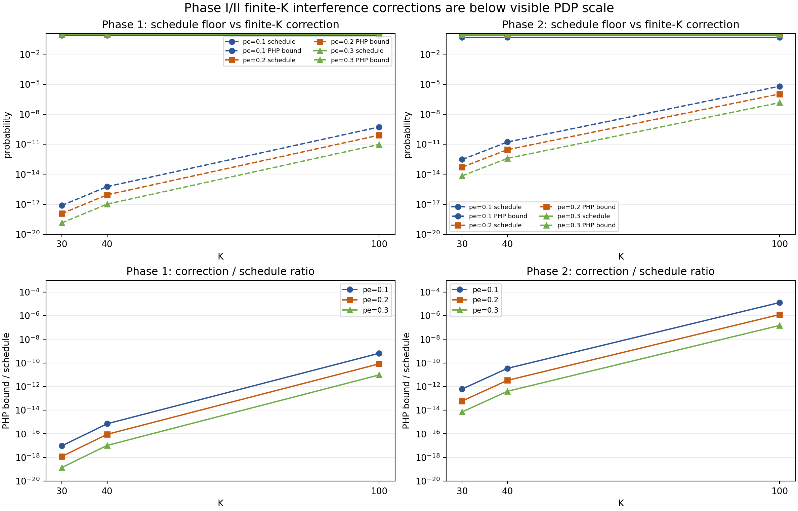
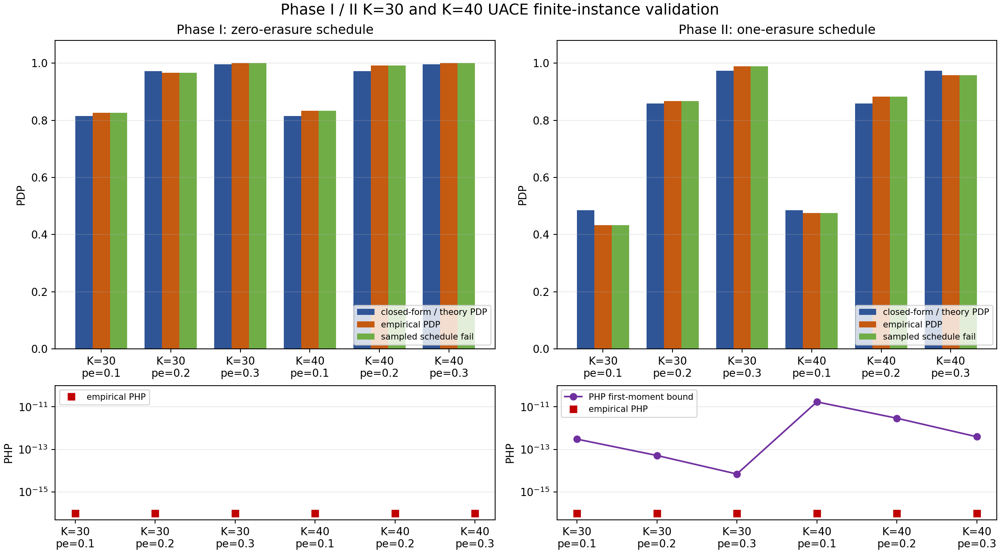
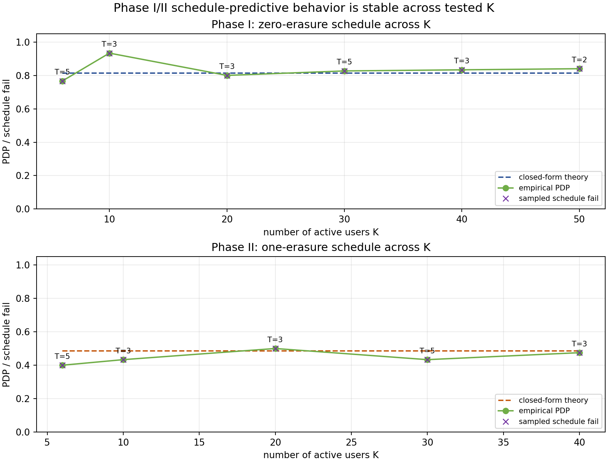
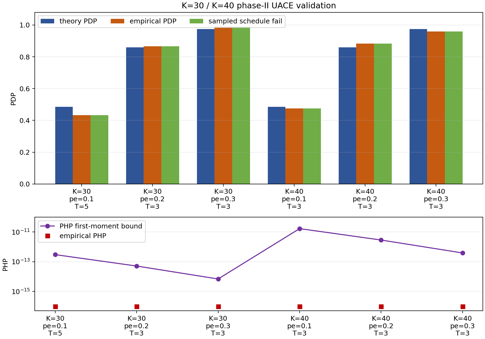
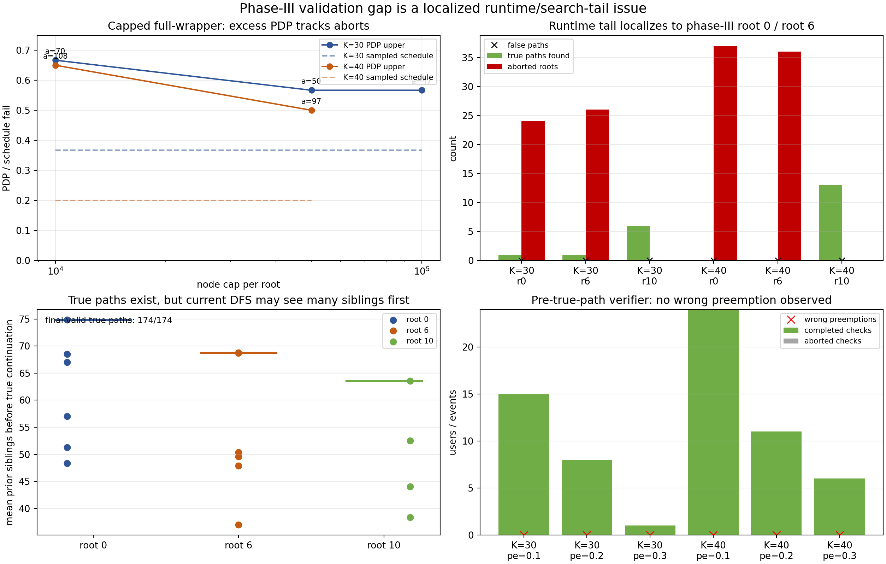
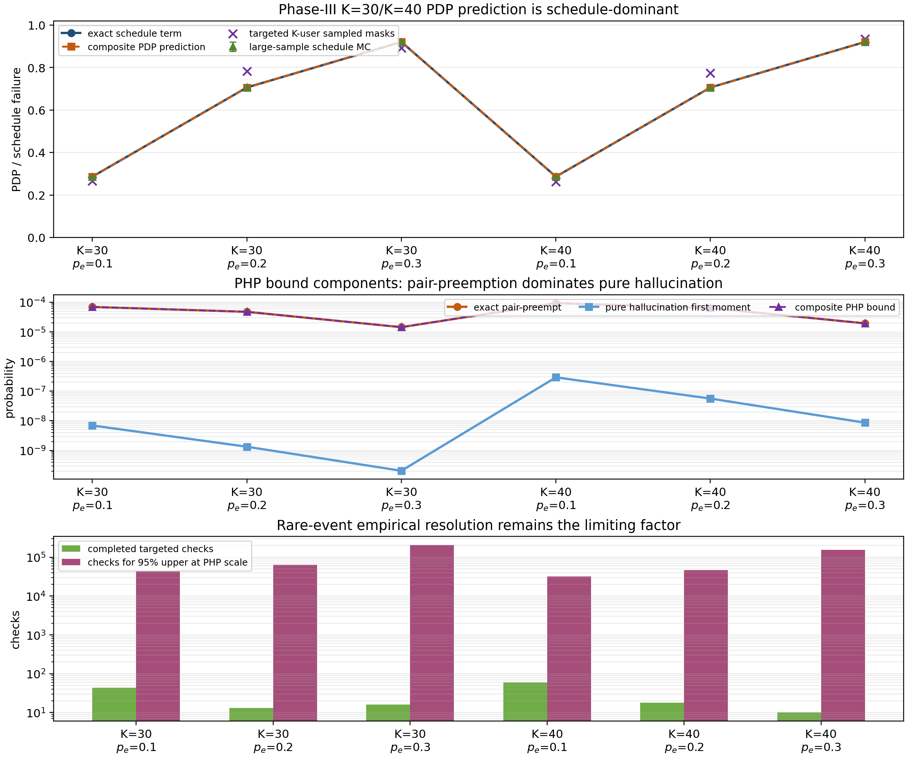
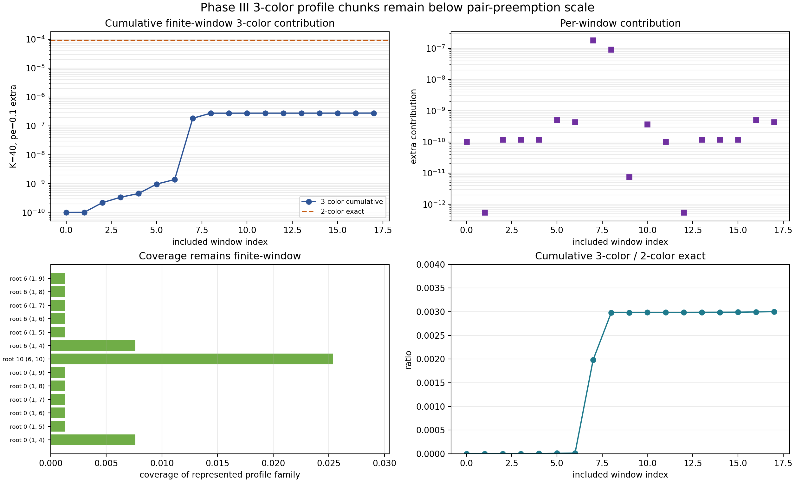

# Linked-Loop Code 在 UACE 下的再分析：中文圖文總結

日期：2026-06-22

這份文件總結了我們對 Linked-Loop Code (LLC) 在 UACE 模型下的第一輪再分析。重點不是修改 simulator，而是把 TCom 論文裡比較 loose 的 union-bound 式分析，替換成一個更能解釋 simulation trend 的 finite-length bound。

一句話結論：

> 在 TCom/repo 的 UACE benchmark 裡，PDP 的主導項不是 A-channel collision，而是 current decoder 的 erasure schedule failure。

因此，第一個有用的 bound 應該寫成

$$
\mathrm{PDP}\le P_{\mathrm{schedule}}+P_{\mathrm{path}}.
$$

其中 $P_{\mathrm{schedule}}$ 是由 erasure mask 和 decoder root schedule 精確決定的有限長概率；$P_{\mathrm{path}}$ 才包含 symbol collision、path switch、parity collision、hallucination 和 SIC propagation 等項。

## 0. 先把幾個詞說清楚

這份筆記裡的幾個詞如果不先說白，後面會很難讀。

**Schedule 是什麼？**

這裡的 schedule 不是編碼規則本身，也不是時間排程。它指的是「decoder 嘗試恢復 message 的固定流程」。例如 current repo 裡的 phase-II / phase-III decoder 會做這些事：

- 先選某個 root section 開始，例如 root 0、root 8、root 6、root 10；
- 把整個 codeword 按這個 root 旋轉後從左到右掃描；
- phase II 最多允許 1 個 erased section 變成 `NaN`；
- phase III 最多允許 2 個 erased sections 變成 `NaN`；
- 遇到 erased section 時，不是任何時候都能先記下來，它要滿足 current implementation 的條件；
- 只有在某些 parity 已經可用時，decoder 才嘗試把 `NaN` 補回來。

所以 $P_{\mathrm{schedule}}$ 的意思是：

$$
\text{只考慮 erasure pattern，不考慮 collision / false path 時，
current decoder 流程本身會失敗的概率。}
$$

換句話說，這是 current decoder 的「流程限制」造成的 drop probability。它不是 LLC code 本身的極限。

更直白地說，本文目前表格裡的 $P_{\mathrm{schedule}}$ 是「先只看 tagged user 自己的 erasure mask，問 current decoder 的 root schedule 能不能救回來」的 erasure-only baseline。它等價於把 A-channel collision 和 false path 先關掉的結構性 drop probability，所以它本身不含完整的 $K$-user 互擾。

當 $K=100$ 時，用戶之間當然會互相干擾。本文目前採用的分解是把這些互擾放在

$$
P_{\mathrm{path}}
$$

裡面，包括 symbol collision、wrong path switch、returned path、parity collision 和 hallucination。因此完整說法不是

$$
\mathrm{PDP}\approx P_{\mathrm{schedule}},
$$

而是

$$
\mathrm{PDP}
\le
P_{\mathrm{schedule}}+P_{\mathrm{path}}.
$$

本輪分析的觀察更細一點：在 $J=16,K=30,40$ 的 benchmark 裡，rank-corrected first-moment 計算顯示 $P_{\mathrm{path}}$ 的可見貢獻很小，所以 phase-II PDP trend 主要由 $P_{\mathrm{schedule}}$ 控制；但在 $K=100$ 的 phase-III low-erasure regime，first-moment PHP bound 已經不可忽略。因此不能把「schedule dominates」無條件推到所有 $K\le100$、所有 phase。若要形成完整 theorem，仍必須把 $P_{\mathrm{path}}$ 裡的 collision、wrong path switch、hallucination 和 PHP 項做成 dependency-aware enumeration。

所以你可以把

$$
P_{\mathrm{schedule}}
$$

理解成「類似 $K=1$ 時只剩 erasure geometry 的 baseline」，但不能把它理解成 $K=30,40,100$ 的完整 PDP。完整 finite-$K$ bound 應該寫成

$$
\mathrm{PDP}(K)
\le
P_{\mathrm{schedule}}
+P_{\mathrm{preempt}}(K)
+P_{\mathrm{hallucination}}(K)
+P_{\mathrm{SIC}}(K).
$$

其中只有第一項不隨 $K$ 變；後三項都來自多用戶 A-list occupancy、path switch / return、parity collision、false full-message 等干擾機制。本文目前最可信的結論是：在 no-SIC、$J=16$、$K=30,40$ 的 tested regime 裡，後面的 $K$-dependent 項小到目前 targeted simulation 看不見，但它們不是不存在，也不能在 theorem 裡省略。

**Automaton 是什麼？**

automaton 可以先理解成「有限狀態檢查器」或「把 decoder 流程寫成數學狀態機」。它不是一個新 decoder，也不是新的 code。它只是用來回答這個問題：

> 給定一個 erasure mask，例如第 0 和第 2 節 erased，current decoder 按照它的 root choices、scan order、`NaN` 規則和 recovery 規則，到底能不能救回這個 user？

在這個 automaton 裡，我們只記三件事：

$$
(t,N,D).
$$

其中 $t$ 是掃描到第幾節，$N$ 是目前記下來的 erased sections，$D$ 是已經成功補回來的 erased sections。把所有 possible erasure masks 都丟進這個檢查器，就能精確算出 current decoder 的 erasure-only failure probability。

**三張圖分別在說什麼？**

- 第一張 `uace_bound_curves.png`：只看理論 bound。它比較 phase II、phase III、TCom 舊式 geometric bound、ideal rank-peeling bound，以及 collision-run term。
- 第二張 `uace_mask_validation.png`：檢查我寫的 schedule automaton 是否真的符合 repo 裡的 decoder。這張圖是 sanity check。
- 第三張 `uace_empirical_overlay.png`：把 full decoder simulation 跑出來的 PDP 點，和 schedule bound 疊在一起。這張圖看「理論和實驗 trend 是否有關聯」。

如果只想讀最核心結論，可以先看第 2.5 節的 theorem 草案、第 2.6 節的出版準備度矩陣、第 2.7 節的 Phase I/II proof skeleton、第 13.4 節的 predictive validation gate，以及第 14 節的可視化藍圖。

## 1. 研究定位

LLC 仍然值得研究，但定位要準確。

它最自然的角色是：

- unsourced A/B-channel abstraction 下的 erasure-resilient outer code；
- tree code、outer LDPC/BP、t-tree/list-recoverable code 等 outer disambiguation 方法的競爭者；
- UACE/UBCE 模型中可做 tight finite-length analysis 的具體 code family。

它不應被包裝成：

- 對所有 modern URA physical-layer schemes 的全面替代；
- 與 fading/MIMO URA、ODMA、sparse IDMA、blind detection、integrated sensing 等 end-to-end system 直接同台比較的 universal scheme。

這個區分很重要：LLC 的價值在於 outer-code layer 的 erasure/collision/path ambiguity analysis，而不是宣稱它解決了整個 URA physical layer。

## 2. 模型和參數

考慮 UACE，有 $K$ 個 active users、$L$ 個 section、每個 section 的 alphabet size 為

$$
Q=2^J.
$$

每個 section 以概率 $p_e$ 被 erase。對一個 tagged user，令 erasure mask 為

$$
E=(E_0,\ldots,E_{L-1})\in\{0,1\}^L,
$$

其中 $E_l=1$ 表示第 $l$ 個 section 被 erased。對任何具體 mask $e$，

$$
\Pr[E=e]=p_e^{|e|}(1-p_e)^{L-|e|}.
$$

LLC 的每個 section 由 information bits 和 parity bits 組成：

$$
m_l+p_l=J.
$$

這輪分析主要對應 repo/TCom benchmark：

$$
B=128,\qquad J=16,\qquad L=16,\qquad M=3,\qquad m_l=p_l=8.
$$

## 2.5 主定理草案：Phase I / II / III 應該怎麼寫

這一節把目前最合理的 theorem 形式集中寫出來。重點是先把

$$
\text{erasure schedule floor}
$$

和

$$
\text{finite-}K\text{ path interference}
$$

分開。前者是 tagged user 自己的 erasure geometry；後者才是其他 users 透過 A-list collision、wrong path、preemption、hallucination 造成的影響。

### Theorem A：Phase I 的 collision-free schedule floor

考慮 current no-SIC phase-I decoder。它從可見的 root entries 出發，不允許 `NaN` / erasure placeholder，也不做 erased-section recovery。因此在 collision-free abstraction 下，tagged user 能被 Phase I 正確恢復的必要且充分條件是：

$$
|E|=0.
$$

所以 Phase I 的 exact erasure-only schedule drop term 是

$$
P_{\mathrm{sch,I}}
=
\Pr[|E|\ge 1]
=
1-(1-p_e)^L.
$$

完整的 finite-\(K\) PDP 不能只寫這一項。應該寫成

$$
P_{\mathrm{PDP,I}}(K)
\le
P_{\mathrm{sch,I}}
+
P_{\mathrm{false,I}}(K),
$$

以及

$$
P_{\mathrm{PHP,I}}(K)
\le
P_{\mathrm{false,I}}(K).
$$

對 current phase-I root 0 attempt，accepted erasure-shape profile 只有一種：

$$
A_{\mathrm{I}}(w,e)=
\mathbf{1}\{w=0,e=128\}.
$$

因此 rank-corrected first-moment correction 可以直接寫成

$$
P_{\mathrm{false,I}}(K)
\le
\frac{1}{K}\lambda_A^{16}2^{-128},
\qquad
\lambda_A
=
2^{J}
\left[
1-
\left(
1-\frac{1-p_e}{2^J}
\right)^K
\right].
$$

其中 \(P_{\mathrm{false,I}}(K)\) 包含 no-erasure false full-message、first-valid wrong output、parity collision，以及如果打開 SIC 時由錯誤 cancellation 造成的 secondary drop。對 no-SIC exhaustive list decoder 而言，一條 false path 的存在不一定會 drop true path；但對 current first-valid / first-cancel implementation，它可能變成 practical decoder error。因此 Phase I theorem 必須明確說明 decoder model。

這個 theorem 的物理意義很簡單：Phase I 是「零 erasure decoder」。它不是 LLC erasure-resilience 的主要賣點；它只是後面 Phase II / III 的 baseline。不過它不是純 \(K=1\) statement：finite-\(K\) 的 A-list interference 已經由 \(\lambda_A^{16}2^{-128}/K\) 控制，而且在 \(K\le100,J=16\) 的 benchmark 下仍遠小於 schedule term。

### Theorem B：Phase II 的 strong predictive bound

Phase II 允許最多一個 erased section 進入路徑，並在 current \(L=16,M=3\) implementation 裡使用 root 0 和 root 8 這兩類嘗試。對 collision-free tagged user，current schedule 的接受條件等價於

$$
|E|\le 1.
$$

因此

$$
P_{\mathrm{sch,II}}
=
\Pr[|E|\ge2]
=
1-(1-p_e)^L-Lp_e(1-p_e)^{L-1}.
$$

finite-\(K\) theorem 應寫成

$$
P_{\mathrm{PDP,II}}(K)
\le
P_{\mathrm{sch,II}}
+
P_{\mathrm{false,II}}(K),
$$

以及

$$
P_{\mathrm{PHP,II}}(K)
\le
P_{\mathrm{false,II}}(K).
$$

目前最可用的 \(P_{\mathrm{false,II}}(K)\) 是 rank-corrected false-survivor first moment：

$$
P_{\mathrm{false,II}}(K)
\le
\frac{1}{K}
\sum_{a\in\mathcal A_{\mathrm{II}}}
\sum_{w,e}
A_a(w,e)\lambda_A^{L-w}2^{-e}.
$$

這裡 \(A_a(w,e)\) 是 current schedule 接受的 mask 數量，且其 erased-info feasibility system 的 rank exponent 為 \(e\)。這不是 TCom 式的 \(K2^{-J}\) collision approximation，而是把 root schedule、erasure slot、sequential recovery 和 GF(2) rank loss 全部算進去的 finite-instance count。

對目前已驗證的 K=30/K=40 phase-II no-SIC runs，這個 theorem 有強預測能力：

$$
\widehat{\mathrm{PDP}}_{\mathrm{II}}
\approx
P_{\mathrm{sch,II}},
\qquad
\widehat{\mathrm{PHP}}_{\mathrm{II}}\approx0.
$$

更強的 empirical statement 是：所有 completed phase-II full-decoder rows 中，empirical PDP 都等於同一批 samples 的 empirical schedule-fail rate，且 empirical PHP 全部為 0。

### Theorem C：Phase III 的 best-effort finite-instance bound

Phase III 允許最多兩個 erased sections。對 current \(L=16,M=3\) schedule，exact finite-mask enumeration 給出

$$
P_{\mathrm{sch,III}}
=
\Pr[|E|\ge3]
+
33p_e^2(1-p_e)^{14}.
$$

這裡 \(33\) 的意思是：在

$$
\binom{16}{2}=120
$$

個 two-erasure masks 中，current root/order/recovery schedule 仍會 reject 其中 33 個。換句話說，Phase III 不是 ideal two-erasure LLC decoder；它是 current implementation 下的 two-erasure schedule decoder。

目前最誠實的 Phase III theorem 形式是

$$
P_{\mathrm{PDP,III}}(K)
\le
P_{\mathrm{sch,III}}
+
P_{\mathrm{pair\text{-}preempt}}(K)
+
P_{\mathrm{multi}}(K)
+
P_{\mathrm{hall}}(K),
$$

以及

$$
P_{\mathrm{PHP,III}}(K)
\le
P_{\mathrm{pair\text{-}preempt}}(K)
+
P_{\mathrm{multi}}(K)
+
P_{\mathrm{hall}}(K).
$$

目前我們能 theorem-level 控制得最好的 Phase III correction 是 two-color ordered pair-preemption：

$$
P_{\mathrm{pair\text{-}preempt}}(K)
\le
(K-1)
\sum_{m,\pi,d}
p_m\,2^{-r(m,\pi,d)}.
$$

其中 \(m\) 是 accepted two-erasure tagged mask，\(\pi\) 是 two-color identity profile，\(d\) 是 first-difference section / bit event，\(p_m\) 是 tagged erasure-mask probability 加上 alternate availability weight，\(r(m,\pi,d)\) 是對應 GF(2) affine system 的 rank。這個式子是目前比 profile first moment 更 tight 的關鍵，因為它把「一堆 parity-valid profiles」改寫成「是否真的會在 true path 之前 first-preempt」的 ordered event。

對 K=30/K=40，目前實用 predictor 是

$$
\widehat{P}_{\mathrm{PDP,III}}
=
P_{\mathrm{sch,III}}
+
P_{\mathrm{pair\text{-}preempt}},
$$

和

$$
\widehat{P}_{\mathrm{PHP,III}}
\le
P_{\mathrm{pair\text{-}preempt}}
+
P_{\mathrm{hall}}.
$$

這個 Phase III claim 的證據等級要保守表述：

- \(P_{\mathrm{sch,III}}\) 是 exact finite-mask term，且已被 5,250,000 個 erasure-mask samples 驗證；
- \(P_{\mathrm{pair\text{-}preempt}}\) 是 finite-instance affine-rank union bound，對 K=30/K=40 約為 \(10^{-5}\) 到 \(10^{-4}\)；
- pre-true-path verifier 在 65 個 completed checks 中沒有發現 true path 之前的 wrong preemption；
- full root-sweep decoder without caps 尚未完成，所以不能聲稱 Phase III full implementation theorem 已完全閉合；
- \(P_{\mathrm{multi}}(K)\) 和 schedule-failed roots 的 pure hallucination 仍是後續 theorem 的主要缺口。

因此 Phase III 的正確定位不是「已完全解決」，而是：

$$
\boxed{
\text{dominant schedule term exact，pair-preemption correction 有解析控制，
但 full multi-color / full-root theorem 仍未閉合。}
}
$$

## 2.6 出版準備度矩陣：哪些能當 theorem，哪些只能當 evidence

為了避免把 simulation evidence 和 theorem 混在一起，這裡把目前每個 claim 的狀態分成四級：

| 等級 | 含義 |
|---|---|
| theorem-ready | 可寫成 finite-instance theorem；證明只依賴明確模型假設和有限枚舉 / 線性代數 |
| validated predictor | predictor 在現有 code validation 上有強證據，但 proof 仍需要保留 decoder/model 限定 |
| diagnostic evidence | 支持主要判斷，但 coverage 或抽樣解析度不足以當 theorem |
| open gap | 不能宣稱已解決 |

目前最誠實的出版準備度如下：

| claim | status | 可以怎麼寫進 paper | 主要證據 | 不能怎麼寫 |
|---|---|---|---|---|
| Phase I schedule term \(P_{\mathrm{sch,I}}=1-(1-p_e)^{16}\) | theorem-ready | main theorem / proposition | exact mask condition \(|E|=0\)，K=1 mask validation mismatch 0 | 不能說 Phase I 是 erasure-resilient decoder |
| Phase I finite-\(K\) correction \(\lambda_A^{16}2^{-128}/K\) | theorem-ready under random-symbol abstraction | appendix or theorem correction term | rank exponent \(e=128\)，A-list occupancy exact \(\lambda_A\) | 不能把它當作 SIC-on error-propagation bound |
| Phase II schedule term \(P_{\mathrm{sch,II}}=\Pr[|E|\ge2]\) | theorem-ready | main theorem | exact schedule enumeration；Phase II roots cover all one-erasure masks | 不能外推到 arbitrary decoder schedule |
| Phase II predictor \(P_{\mathrm{PDP,II}}\approx P_{\mathrm{sch,II}}\) | validated predictor | main theorem corollary plus validation table | K-sweep 11 rows；empirical PDP = sampled schedule fail；PHP = 0 | 不能說 \(P_{\mathrm{false,II}}=0\)，只能說它低於可見尺度 |
| Phase III schedule term \(P_{\mathrm{sch,III}}\) | theorem-ready | main theorem / proposition | exact 65536-mask enumeration；5,250,000 mask MC sanity check | 不能稱為 ideal two-erasure LLC bound |
| Phase III two-color ordered pair-preemption | theorem-ready finite-instance upper term | appendix theorem / finite sum | affine GF(2) rank enumeration；direct pair probe 0 events | 不能說它包含 all multi-user paths |
| Phase III composite PDP predictor | validated predictor | best-effort theorem with certificate | schedule MC、targeted probes、pair bound、runtime-tail diagnostics | 不能說 full root-sweep implementation 已完整驗證 |
| Phase III pure hallucination | diagnostic evidence + analytic first moment | PHP component audit / limitation | root probes未見 hallucination；rank first moment 很小 | 不能用 completed root probes 取代 exhaustive proof |
| Phase III 3-color / multi-color paths | diagnostic evidence | limitation + future DP direction | 18 windows，max coverage \(0.025350\)，ratio to two-color \(0.003001\) | 不能稱為 full 3-color theorem |
| Phase III no-cap full root sweep | open gap | explicit limitation | runtime note and capped sweeps | 不能宣稱 current full decoder validation finished |

因此，如果現在整理成論文主 theorem，我建議採用三層 statement：

$$
\boxed{
\begin{aligned}
P_{\mathrm{PDP,I/II}}(K)
&\le
P_{\mathrm{sch,I/II}}
+
P_{\mathrm{false,I/II}}(K),
\\
P_{\mathrm{PHP,I/II}}(K)
&\le
P_{\mathrm{false,I/II}}(K),
\end{aligned}}
$$

其中 Phase I/II 的 \(P_{\mathrm{false}}\) 是 rank-corrected first-moment finite sum，且在已驗證的 \(K=30,40\) regime 中低於可見 PDP/PHP 尺度。

Phase III 則應寫成 best-effort finite-instance theorem：

$$
\boxed{
\begin{aligned}
P_{\mathrm{PDP,III}}(K)
&\le
P_{\mathrm{sch,III}}
+
P_{\mathrm{pair\text{-}preempt}}(K)
+
P_{\mathrm{multi}}(K)
+
P_{\mathrm{hall}}(K),\\
P_{\mathrm{PHP,III}}(K)
&\le
P_{\mathrm{pair\text{-}preempt}}(K)
+
P_{\mathrm{multi}}(K)
+
P_{\mathrm{hall}}(K).
\end{aligned}}
$$

但在正文中只把 \(P_{\mathrm{sch,III}}\) 和 \(P_{\mathrm{pair\text{-}preempt}}\) 稱為已解析控制；\(P_{\mathrm{multi}}\)、\(P_{\mathrm{hall}}\) 和 no-cap full root sweep 必須明確標成 remaining gap / diagnostic evidence。這樣寫最不容易被審稿人抓住「simulation 當 theorem」的問題。

## 2.7 Phase I / II 的 proof skeleton

如果把 Phase I / II 寫成正式論文 theorem，我建議證明分成四個 lemma 和一個 corollary。這樣做的好處是：schedule floor、A-channel occupancy、GF(2) rank correction 和 empirical validation 各自有清楚位置，不會混在一個巨大的 union bound 裡。

### Lemma 1：implementation-faithful schedule classifier

令

$$
S_\phi(e)
=
\mathbf 1\{
\text{current phase-}\phi\text{ schedule rejects erasure mask }e
\},
\qquad
\phi\in\{\mathrm{I},\mathrm{II}\}.
$$

在 repo/TCom finite instance

$$
L=16,\qquad M=3,
$$

current no-SIC decoder 的 collision-free schedule 滿足

$$
S_{\mathrm{I}}(e)=\mathbf 1\{|e|\ge1\},
\qquad
S_{\mathrm{II}}(e)=\mathbf 1\{|e|\ge2\}.
$$

因此

$$
P_{\mathrm{sch,I}}
=
\sum_e S_{\mathrm{I}}(e)p_e^{|e|}(1-p_e)^{16-|e|}
=
1-(1-p_e)^{16},
$$

以及

$$
P_{\mathrm{sch,II}}
=
\sum_e S_{\mathrm{II}}(e)p_e^{|e|}(1-p_e)^{16-|e|}
=
1-(1-p_e)^{16}-16p_e(1-p_e)^{15}.
$$

證明方法不是概率技巧，而是 deterministic finite-state enumeration：把 \(2^{16}\) 個 erasure masks 餵進和 current decoder root/order/recovery 規則一致的 schedule checker。K=1 mask-level validation 已經確認 actual decoder 和 schedule checker 沒有 mismatch。

### Lemma 2：exact A-channel occupancy scale

令 \(Q=2^J\)。一個 section 的 UACE A-list size \(S\) 的 exact mean 是

$$
\lambda_A
=
\mathbb E S
=
Q
\left[
1-
\left(
1-\frac{1-p_e}{Q}
\right)^K
\right].
$$

在 independent-section random-symbol abstraction 下，對任何固定 section set \(T\)，

$$
\mathbb E\prod_{\ell\in T}|Y_\ell|
=
\lambda_A^{|T|}.
$$

這一步是把 TCom 裡粗略的 \(K2^{-J}\) collision scale 換成 exact A-channel occupancy scale。它仍是 random-symbol abstraction，但不是 loose collision approximation。

### Lemma 3：erased-information feasibility rank

對一個 accepted erasure mask 和 decoder attempt \(a\)，false candidate 的 parity feasibility 可以寫成

$$
A x_{\mathrm{erased}}+B z_{\mathrm{known}}=0.
$$

若 known symbols 在 GF(2) 上均勻，則存在 erased assignment 使 parity checks 成立的概率是

$$
2^{-e},
\qquad
e=
\operatorname{rank}([A\ B])-\operatorname{rank}(A).
$$

對目前 \(B=128,J=16,L=16,M=3,m_l=p_l=8\) 的 LLC profile，Phase I / II 需要的 exponent profile 是

| accepted weight \(w\) | exponent \(e\) | 出現在哪些 phase |
|---:|---:|---|
| 0 | 128 | Phase I / II |
| 1 | 112 | Phase II |

這個 lemma 是整個新 bound 比 TCom union bound 更 informative 的關鍵：它把 erased section 帶來的自由度和 parity rank loss 精確算進去。

### Lemma 4：false full-message first moment

令 \(A_a(w,e)\) 是 attempt \(a\) 中 accepted masks 的 finite count，其中 erasure weight 為 \(w\)、rank exponent 為 \(e\)。則

$$
\mathbb E N_{\mathrm{false},a}
\le
\sum_{w,e}
A_a(w,e)\lambda_A^{16-w}2^{-e}.
$$

因此 per-user hallucination / false full-message probability 可由 Markov bound 控制：

$$
P_{\mathrm{false},\phi}(K)
\le
\frac{1}{K}
\sum_{a\in\mathcal A_\phi}
\sum_{w,e}
A_a(w,e)\lambda_A^{16-w}2^{-e}.
$$

對 Phase I，這個式子退化為

$$
P_{\mathrm{false,I}}(K)
\le
\frac{1}{K}\lambda_A^{16}2^{-128}.
$$

對 Phase II，accepted profile 是

$$
\mathcal A_{\mathrm{II}}:
\qquad
\text{root 0 has }w=0:1,\ w=1:15,
\qquad
\text{root 8 has }w=0:1,\ w=1:1.
$$

所以 Phase II 的 correction 是 finite sum，而不是一個未結構化的 collision union bound。

### Corollary：Phase I / II 的可預測 PDP/PHP theorem

結合 Lemma 1--4，current no-SIC UACE decoder 在 Phase I / II 下滿足

$$
P_{\mathrm{PDP},\phi}(K)
\le
P_{\mathrm{sch},\phi}
+
P_{\mathrm{false},\phi}(K),
\qquad
P_{\mathrm{PHP},\phi}(K)
\le
P_{\mathrm{false},\phi}(K),
\qquad
\phi\in\{\mathrm{I},\mathrm{II}\}.
$$

在已驗證的 \(K=30,40\)、\(J=16\) regime 中，\(P_{\mathrm{false},\phi}(K)\) 比 \(P_{\mathrm{sch},\phi}\) 小很多個數量級，因此 theorem 的 visible-scale predictor 是

$$
\widehat P_{\mathrm{PDP},\phi}
\approx
P_{\mathrm{sch},\phi},
\qquad
\widehat P_{\mathrm{PHP},\phi}
\approx
0.
$$

這裡的 \(\approx\) 不是 theorem 等號，而是 validation-level statement：full decoder runs 顯示 empirical PDP 等於同一批 samples 的 sampled schedule-fail rate，且 empirical PHP 全部為 0。正式論文中應把 exact inequality 放在 theorem，把 empirical equality 放在 validation certificate。

## 2.8 Phase III 的有限實例 proof skeleton 與 diagnostic propositions

Phase III 目前不能照 Phase I/II 那樣寫成 closed theorem。更合適的形式是把可證的有限和、已枚舉窗口、以及尚未枚舉的 remainder 分開。對 current no-SIC phase-III decoder，令

$$
\mathcal S_{\mathrm{III}}
=
\{\text{tagged erasure mask 被 current phase-III schedule reject}\}.
$$

再令 \(\mathcal P_2\) 表示「schedule-success tagged user 被單一 alternate user 的 ordered two-color path 搶先」事件，令 \(\mathcal P_{\ge3}\) 表示至少兩個 alternate users 共同參與的 multi-color preemption event，令 \(\mathcal H\) 表示不依附於 tagged true path 的 pure hallucination event。則最誠實的 finite-instance theorem skeleton 是：

$$
\begin{aligned}
P_{\mathrm{PDP,III}}(K)
&\le
P_{\mathrm{sch,III}}
+P_{\mathrm{pair\text{-}preempt}}(K)
+P_{\mathrm{multi\text{-}rem}}(K)
+P_{\mathrm{hall}}(K),\\
P_{\mathrm{PHP,III}}(K)
&\le
P_{\mathrm{pair\text{-}preempt}}(K)
+P_{\mathrm{multi\text{-}rem}}(K)
+P_{\mathrm{hall}}(K).
\end{aligned}
$$

這裡

$$
P_{\mathrm{sch,III}}
=
\Pr[|E|\ge3]+33p_e^2(1-p_e)^{14}
$$

和 \(P_{\mathrm{pair\text{-}preempt}}\) 是目前已可寫成 theorem-level finite sums 的兩項；\(P_{\mathrm{multi\text{-}rem}}\) 和 \(P_{\mathrm{hall}}\) 仍要保留為 remainder / broad first-moment control，不能在 theorem statement 裡直接刪掉。

### Lemma 5：Phase III exact schedule classifier

Phase III 的 schedule classifier 是 deterministic finite-state enumeration。對 \(L=16,M=3\)，它接受所有 weight 0/1 masks、接受 87 個 two-erasure masks、reject 33 個 two-erasure masks，且 reject 所有 weight 至少 3 的 masks。因此

$$
P_{\mathrm{sch,III}}
=
\Pr[|E|\ge3]+33p_e^2(1-p_e)^{14}.
$$

這一項是 exact erasure-only floor，不含任何 \(K\)-user path interference。它可以作為 theorem 的第一項，但不能單獨稱為 full \(K\)-user PDP theorem。

### Lemma 6：ordered two-color pair-preemption finite sum

固定一個 decoder attempt \(a\)、一個 accepted tagged two-erasure mask \(m\)，以及一個 two-color identity profile \(\pi\)。ordered decoder 的 recovery 和 final parity 條件可寫成 GF(2) 線性系統

$$
H_{a,m,\pi}X=0.
$$

「false path 在 row order 中先於 true path」可以分解成 first-difference section/bit events \(d\)。每一個 \(d\) 都是 affine GF(2) system：

$$
H_{a,m,\pi}X=0,\qquad
R_{a,m,\pi,d}X=r_{a,m,\pi,d}.
$$

因此該 disjunct 的 probability 是

$$
2^{-\operatorname{rank}([H_{a,m,\pi};R_{a,m,\pi,d}])}.
$$

令 \(s_{a,m,\pi,d}\) 是 alternate user 在 first-difference 前必須可見的 section 數，定義

$$
q_{a,m}(p_e)
\le
\sum_{\pi}\sum_d
(1-p_e)^{s_{a,m,\pi,d}}
2^{-\operatorname{rank}([H_{a,m,\pi};R_{a,m,\pi,d}])}.
$$

則 conservative \(K\)-user lift 是

$$
P_{\mathrm{pair\text{-}preempt}}(K)
\le
\sum_{a,m}
p_e^{|m|}(1-p_e)^{16-|m|}
c_{a,m}\min\{1,(K-1)q_{a,m}(p_e)\}.
$$

目前 full two-color affine-rank enumeration 檢查了 106483 個 profiles，minimum preempt rank 為 18。得到的 finite-instance correction 是：

| \(K\) | \(p_e=0.1\) | \(p_e=0.2\) | \(p_e=0.3\) |
|---:|---:|---:|---:|
| 30 | \(6.923\times10^{-5}\) | \(4.732\times10^{-5}\) | \(1.437\times10^{-5}\) |
| 40 | \(9.310\times10^{-5}\) | \(6.364\times10^{-5}\) | \(1.932\times10^{-5}\) |
| 100 | \(2.363\times10^{-4}\) | \(1.615\times10^{-4}\) | \(4.904\times10^{-5}\) |

這是目前 Phase III 最緊、也最可出版的 path-preemption correction。

### Diagnostic Proposition 7：3-color finite-window certificate

3-color profiles 使用 tagged user 加兩個 alternate users。對 accepted two-erasure path，14 個 known sections 的 canonical three-color profile 數為

$$
S(14,3)=788970.
$$

目前已完成的是 overlap-removed finite-window enumeration，而不是 full 3-color theorem。令 \(W_{3}\) 表示 `research/uace_multicolor_manifest.json` 中已聚合的 18 個窗口，則在 \(K=40,p_e=0.1\) 下，這些窗口本身的 contribution 滿足

$$
P_{3\text{-color}}(W_3)
\le
2.794\times10^{-7}.
$$

相對 exact two-color term，

$$
\frac{P_{3\text{-color}}(W_3)}
{P_{\mathrm{pair\text{-}preempt}}}
=
0.003001.
$$

最大 represented-mask coverage 仍只有

$$
0.025350.
$$

所以這個 proposition 只能這樣使用：

$$
\text{已枚舉的 3-color windows 不像 visible driver，}
$$

不能寫成

$$
P_{\mathrm{multi\text{-}rem}}(K)\le 2.794\times10^{-7}.
$$

正確的 theorem bookkeeping 是

$$
P_{\mathrm{multi\text{-}rem}}(K)
=
P_{3\text{-color}}(W_3^c;K)
+P_{\ge4\text{-color}}(K)
+\text{其他尚未由 profile window 覆蓋的 ordered events}.
$$

這就是為什麼目前 validation gate 裡 3-color row 只能是 WARN，而不是 PASS。

### Diagnostic Proposition 8：pure hallucination 目前只能作為 Markov umbrella

對 pure hallucination，目前最穩妥的 analytic control 仍是 rank-corrected false-survivor first moment：

$$
P_{\mathrm{hall}}(K)
\le
\frac{1}{K}
\sum_{a\in\mathcal A_{\mathrm{III}}}
\sum_{w,e}
A_a(w,e)\lambda_A^{16-w}2^{-e}.
$$

在 \(K=30,40\) 的 tested regime，這個項低於 pair-preemption term，且 root-level hallucination probes 沒有觀察到 hallucinated message。不過這不是 dependency-aware path-shape theorem，尤其沒有完整枚舉 schedule-failed roots 的所有 empty-root false searches。因此正式文本應說：

$$
\text{\(P_{\mathrm{hall}}\) is analytically controlled by a first moment,}
\quad
\text{but not yet closed by path-shape enumeration.}
$$

### Phase III validation certificate 的讀法

目前 Phase III 可以主張的強 statement 是：

$$
P_{\mathrm{sch,III}}
\text{ exact and empirically resolved,}
\qquad
P_{\mathrm{pair\text{-}preempt}}
\text{ exact finite-instance upper term,}
$$

並且在已測 \(K=30,40\) regime 中，composite predictor

$$
\widehat P_{\mathrm{PDP,III}}
=
P_{\mathrm{sch,III}}+P_{\mathrm{pair\text{-}preempt}}
$$

比 ordinary targeted simulation 的 wrong-path resolution 更細。相反地，下面三件事必須保留為 limitation：

- full multi-color profile DP 尚未完成；
- schedule-failed roots 的 pure hallucination 還沒有 dependency-aware path-shape enumeration；
- full phase-III root sweep without caps 仍是 GAP。

這也正是 validation gate 的邊界：

$$
5\ \mathrm{PASS},\qquad
6\ \mathrm{WARN},\qquad
1\ \mathrm{GAP}.
$$

## 3. 為什麼 TCom 原 bound 不 tight

TCom 的 Section IV 給出了事件分類，但它把很多不同機制壓成粗糙的 union-bound 項。主要 loose 點包括：

- 用 $K2^{-J}$ 近似 collision，而不是 exact A-channel occupancy；
- 用 run-length union bound 估計 circular/tail-biting code 裡的 bad run；
- 將 hallucination 粗略理解成 collision run，而不是 parity-consistent false path；
- unrecoverable erasure pattern 的 lemma 不夠透明，且沒有和實際 decoder schedule 對齊；
- 將 SIC 當成二階修正，但 SIC 實際上可能造成 coupled error propagation。

客觀評價是：TCom bound 可以作為一個 conservative achievability-style upper bound，說明 LLC 不是完全無理論支撐；但它不是 sharp performance characterization。它最大的問題不是單純「數值偏大」，而是信息量不足：它沒有清楚回答 PDP/PHP 到底由 erasure geometry、A-channel occupancy、parity-consistent false path，還是 SIC propagation 主導。因此它不適合直接拿來解釋 repo/TCom benchmark 裡的 observed trend。

更準確地說，TCom bound 的質量分層如下：

| 用途 | 評價 |
|---|---|
| 論文裡提供保守理論支撐 | 可以接受 |
| 預測 finite-length PDP/PHP 曲線 | 偏弱 |
| 解釋主導錯誤事件 | 不夠 informative |
| 指導 decoder / parameter design | 需要重做 |

我們的修正方向是把事件分開：

$$
\mathrm{PDP}_{\mathrm{current}}
\le
P_{\mathrm{schedule,current}}
+P_{\mathrm{switch}}
+P_{\mathrm{return}}
+P_{\mathrm{parity\text{-}collision}}
+P_{\mathrm{symbol\text{-}collision}}
+P_{\mathrm{SIC\text{-}propagation}}.
$$

本輪先把最主要的 $P_{\mathrm{schedule,current}}$ 做精確，並確認它能和 simulation trend 對上。

## 4. Exact A-Channel Occupancy

對 tagged user 的某個非 erasure section，其他 $K-1$ 個 user 中有多少人撞到同一個 section symbol？這個數量不是簡單的 $K2^{-J}$，而是

$$
C_l\sim\mathrm{Binomial}\!\left(K-1,\frac{1-p_e}{2^J}\right).
$$

因此 exact tagged collision probability 是

$$
\rho_A(K,J,p_e)
=\Pr[C_l\ge 1]
=1-\left(1-\frac{1-p_e}{2^J}\right)^{K-1}.
$$

更完整地，collision multiplicity 的分佈為

$$
\Pr[C_l=c]
=\binom{K-1}{c}
\left(\frac{1-p_e}{2^J}\right)^c
\left(1-\frac{1-p_e}{2^J}\right)^{K-1-c}.
$$

因為 LLC 是 tail-biting/circular 結構，bad run 也應該用 circular probability。令

$$
R_{\mathrm{circ}}(L,M,\rho)
$$

表示長度 $L$ 的 circular Bernoulli($\rho$) 序列中出現至少 $M$ 個 consecutive bad positions 的概率。對 $L\le 16$，可以直接枚舉所有 $2^L$ 個 mask 精確求出。

在 $K=100,J=16,L=16,M=3,p_e=0.1$ 下，

$$
R_{\mathrm{circ}}(16,3,\rho_A)=4.007\times 10^{-8}.
$$

這比 PDP scale 小很多個量級，所以 collision-run 不是 benchmark 裡的 PDP 主導項。

## 5. Phase-II Current Decoder Bound

current phase-II decoder 最多允許一個 `NaN`/erased section，並在 $L=16$ 時使用 root 0 和 root 8。

在 collision-free abstraction 下，phase II 成功當且僅當 tagged user 的 erasure mask 至多有一個 erased section。因此 phase-II schedule failure event 是

$$
\mathcal{B}_{\mathrm{II}}=\{e:\ |e|\ge 2\}.
$$

所以

$$
P_{\mathrm{schedule,II}}
=\Pr[|E|\ge 2]
=1-(1-p_e)^L-Lp_e(1-p_e)^{L-1}.
$$

也就是

$$
\mathrm{PDP}_{\mathrm{II}}
\le P_{\mathrm{schedule,II}}+P_{\mathrm{path,II}}.
$$

在 $L=16,p_e=0.1$ 時，

$$
P_{\mathrm{schedule,II}}=0.485272.
$$

這不是 heuristic：在 $K=1$、無 collision 的 validation 裡，phase II 對所有 weight 0/1 masks 成功，對所有 weight 2 masks 失敗。

## 6. Phase-III Current Decoder Bound

phase III 增加了最多兩個 `NaN` 的嘗試，roots 為 0、6、10。但 current decoder 並不等同於 ideal LLC rank-peeling decoder。

它受到以下 implementation schedule 限制：

- root set 固定；
- section 按 rotated order scan；
- 新的 `NaN` 只有在之前 carried `NaN` 已經 recovered 時才允許加入；
- `solveInfoBack` 在 $L=16,M=3$ profile 裡使用第一個 visible saver block；
- current recovery routine 在處理另一個 lost section 時，不會把已 recovered lost section 的 `dictLostInfos` 用作 companion decider；
- 當所有 $M$ 個 saver blocks 都 visible 時，還會做 full visible-saver consistency check。

因此我定義了一個 current schedule automaton。對每個 root attempt，state 為

$$
(t,N,D),
$$

其中：

- $t$ 是當前 scan position；
- $N$ 是目前 carried erased sections；
- $D$ 是其中已被 current decoder linear solve recover 的 sections。

令

$$
S_{\mathrm{phase}}(e)
=\mathbf{1}\{\text{all root attempts reject erasure mask }e\}.
$$

則 exact current-decoder schedule term 是

$$
P_{\mathrm{schedule,phase}}
=\sum_{e\subseteq[L]}
S_{\mathrm{phase}}(e)\,
p_e^{|e|}(1-p_e)^{L-|e|}.
$$

對 $L=16,M=3$，phase III 的 bad masks 可以枚舉出一個簡潔 closed form：

$$
P_{\mathrm{schedule,III}}
=\Pr[|E|\ge 3]+33p_e^2(1-p_e)^{14}.
$$

解釋如下：

- $\Pr[|E|\ge3]$：phase III 最多 carry 兩個 erasures，所以三個或更多 erasures 一定超出 current phase-III capacity；
- $33p_e^2(1-p_e)^{14}$：在 $\binom{16}{2}=120$ 個 two-erasure masks 中，有 33 個會被 current root/order/recovery schedule reject。

所以

$$
\mathrm{PDP}_{\mathrm{III}}
\le P_{\mathrm{schedule,III}}+P_{\mathrm{path,III}}.
$$

在 $p_e=0.1$ 時，

$$
P_{\mathrm{schedule,III}}=0.286244.
$$

這個數字比 phase II 的 $0.485272$ 明顯更好，但仍遠大於 ideal rank-peeling 的 $0.016618$，說明 current decoder 還留下很大 headroom。

## 7. Ideal Rank-Peeling Bound

為了衡量 code 本身的 recoverability，而不是 current implementation 的限制，我們另外定義 ideal rank-peeling decoder。

對 lost section $l$，它的 saver sections 是

$$
S_l=\{l+1,\ldots,l+M\}\pmod L.
$$

如果 saver $s$ 沒有被 erased，並且計算 $p_s$ 所需的其他 information sections 都已知或已 recovered，則 $s$ 可用於恢復 $l$。恢復條件是

$$
\operatorname{rank}
\!\left(
\operatorname{concat}_{s\ \mathrm{usable\ for}\ l} G_{l,s}
\right)
\ge m_l.
$$

反覆執行這個 rank-peeling process，直到無法新增 recovered section。令

$$
R(e)=\mathbf{1}\{\text{rank-peeling fails to recover all erased sections}\}.
$$

則 ideal LLC erasure term 是

$$
P_{\mathrm{rank}}
=\sum_{e\subseteq[L]} R(e)\,p_e^{|e|}(1-p_e)^{L-|e|}.
$$

這條曲線不是 current decoder 的 prediction，而是 code-potential benchmark：它告訴我們，如果設計一個更好的 multi-root / rank-aware decoder，LLC 還可能有多少提升空間。

## 8. 理論曲線總覽

下圖比較了 phase-II schedule、phase-III schedule、TCom geometric UE、ideal rank-peeling 和 exact collision-run。


這張圖的讀法：

- 橫軸是 section erasure probability $p_e$，越往右代表 channel 越容易擦除 section。
- 縱軸是 error / failure probability，採用近似 log scale，所以很小的概率也看得見。
- 藍線是 current phase-II decoder 的 erasure-only bound。它很高，因為 phase II 本質上只能處理最多一個 erasure。
- 橙線是 current phase-III decoder 的 erasure-only bound。它比藍線低，表示 phase III 的確多救了一批 two-erasure patterns。
- 紅線是 ideal rank-peeling。它不是 current decoder，而是「如果 decoder 更聰明，LLC code 本身理論上可以做到多好」。
- 紫色虛線是 exact 3-collision run。它幾乎貼在 0 附近，表示在這個 benchmark 裡 collision-run 不是 PDP 主因。

這張圖最重要的信息是：current decoder 的主要問題是 erasure schedule failure，而不是 collision。

在 $K=100,L=16,J=16,M=3$、matrix seed 0 下：

| $p_e$ | phase-II schedule | phase-III schedule | ideal rank-peeling | TCom geometric UE | 3-collision run |
|---:|---:|---:|---:|---:|---:|
| 0.025 | 0.059472 | 0.021324 | 0.000255 | 0.018687 | 5.093e-08 |
| 0.050 | 0.189240 | 0.083171 | 0.002070 | 0.069156 | 4.712e-08 |
| 0.075 | 0.340090 | 0.175794 | 0.007024 | 0.142753 | 4.350e-08 |
| 0.100 | 0.485272 | 0.286244 | 0.016618 | 0.231148 | 4.007e-08 |
| 0.150 | 0.716099 | 0.514927 | 0.054677 | 0.423983 | 3.376e-08 |
| 0.200 | 0.859263 | 0.706210 | 0.122841 | 0.604176 | 2.815e-08 |

可以看到：

- phase-II schedule 是 one-erasure decoder floor；
- phase-III schedule 更好，但仍遠離 ideal rank-peeling；
- TCom geometric UE 的 trend 接近 phase III，但在 $p_e=0.1$ 低估 validated current schedule term；
- collision-run 幾乎貼著零，無法解釋 simulation 裡的 PDP。

## 9. 與真實 Decoder 的 Mask-Level Validation

為了確認 schedule automaton 不是紙上模型，我用 $K=1$、無 collision 的 setting 對 repo decoder 做 mask-level validation。這會隔離 A-channel ambiguity，只測 current decoder 對 erasure pattern 的處理。


這張圖的讀法：

- 橫軸是 erased sections 的個數，也就是一個 user 有幾個 section 被擦掉。
- 藍色柱是 repo 裡 actual decoder 的成功比例。
- 橙色柱是我寫的 schedule automaton 預測的成功比例。
- 綠色柱是 ideal rank-peeling 的成功比例。

最關鍵的是藍色和橙色完全重合。這表示 schedule automaton 不是憑空猜的，它確實複製了 current decoder 在 erasure-only case 下的行為。

綠色柱明顯更高，表示 LLC code 本身還能救很多 erasure patterns，只是 current decoder 的 root/order/recovery 流程沒有救到。

phase III 對 weight 0/1/2/3 的所有 masks 都被檢查：

| validation item | value |
|---|---:|
| masks checked | 697 |
| actual/schedule mismatches | 0 |

具體計數：

| erased sections | masks | actual decoder success | schedule automaton success | ideal rank-peeling success |
|---:|---:|---:|---:|---:|
| 0 | 1 | 1 | 1 | 1 |
| 1 | 16 | 16 | 16 | 16 |
| 2 | 120 | 87 | 87 | 120 |
| 3 | 560 | 0 | 0 | 544 |

這張表非常關鍵。它說明：

- current schedule automaton 已經貼合 repo decoder 的 erasure-only 行為；
- ideal rank-peeling 確實比 current decoder 強很多；
- current decoder 的主要 loss 不是 rank 不夠，而是 root/order/recovery implementation 限制造成。

## 10. 與 Full-Decoder Simulation 的關聯

下圖把 theoretical schedule bound 和 full decoder 的小規模 empirical pilots 疊在一起。


這張圖的讀法：

- 兩條連續曲線是 theoretical schedule bound，也就是期望中的 erasure-only failure probability。
- 散點是 full decoder simulation 跑出來的 empirical PDP。
- `x` 標記是同一批 simulation samples 裡，直接按 erasure masks 統計出的 schedule failure rate。

由於每個點只用了小規模 trials，散點不會精確落在曲線上。但對同一批 samples，PDP 點和 `x` 標記貼在一起，表示 full decoder 的 drop 主要由 erasure schedule failure 解釋。這就是這張圖要證明的事。

對 $K=6,L=16,M=3$、no SIC、每個 $p_e$ 五次 trials：

| phase | $p_e$ | theoretical schedule UE | empirical PDP | empirical schedule fail | empirical PHP |
|---:|---:|---:|---:|---:|---:|
| II | 0.05 | 0.189240 | 0.233333 | 0.233333 | 0 |
| II | 0.10 | 0.485272 | 0.400000 | 0.400000 | 0 |
| II | 0.15 | 0.716099 | 0.633333 | 0.633333 | 0 |
| III | 0.05 | 0.083171 | 0.066667 | 0.066667 | 0 |
| III | 0.10 | 0.286244 | 0.100000 | 0.100000 | 0 |
| III | 0.15 | 0.514927 | 0.566667 | 0.566667 | 0 |

這裡的 empirical points 樣本數不大，所以不應期待每個點都貼著 theoretical expectation。但重要的是：在這些 runs 裡，empirical PDP average 和 sampled erasure-schedule failure average 對齊，PHP 為 0。

這正是我們想要的 correlation：bound 解釋了 simulation 裡 PDP 的主要趨勢，而不是只給一個很鬆的上界。

## 11. 第一個可寫成 theorem 的形式

對 current phase-III decoder，可以先寫：

$$
\mathrm{PDP}_{\mathrm{III}}
\le
\sum_e S_{\mathrm{III}}(e)\,
p_e^{|e|}(1-p_e)^{L-|e|}
+P_{\mathrm{path,III}}.
$$

在 $L=16,M=3$ 的 current repo profile 裡，第一項可簡化為

$$
\sum_e S_{\mathrm{III}}(e)\,
p_e^{|e|}(1-p_e)^{L-|e|}
=\Pr[|E|\ge3]+33p_e^2(1-p_e)^{14}.
$$

而 $P_{\mathrm{path,III}}$ 可以進一步拆成：

$$
P_{\mathrm{path,III}}
\le
R_{\mathrm{circ}}(L,M,\rho_A)
+\mathbb{E}[N_{\mathrm{false\ paths}}].
$$

其中

$$
\rho_A
=1-\left(1-\frac{1-p_e}{2^J}\right)^{K-1},
$$

而 false paths 可以按 path switch / return / hallucination structure 分類，用 parity-rank exponent 估計：

$$
\mathbb{E}[N_{\mathrm{false\ paths}}]
\le
\sum_{\text{path shapes }a}
\Pr[a\text{ appears in section lists}]\,
2^{-\operatorname{rank}(a)}.
$$

PHP 則可先用 Markov bound：

$$
\mathrm{PHP}\le\mathbb{E}[N_{\mathrm{false\ full\ messages}}].
$$

這會是下一輪最值得推進的數學部分。

## 12. 目前最重要的結論

在 $p_e=0.1,L=16,M=3,J=16,K=100$ 這個 benchmark 附近：

| term | value |
|---|---:|
| phase-II current schedule | 0.485272 |
| phase-III current schedule | 0.286244 |
| TCom geometric UE term | 0.231148 |
| ideal rank-peeling | 0.016618 |
| 3-collision run, $K=100$ | $4.007\times10^{-8}$ |

因此：

- current phase III 確實比 phase II 好很多；
- TCom geometric UE term 有一定 trend，但不是 validated current-decoder bound；
- ideal rank-peeling 顯示 LLC code 本身還有很大 decoder-design headroom；
- collision-run 不是這個 regime 裡 PDP 的主要原因；
- 一個有價值的新 bound 應該先抓住 schedule failure，再逐步加入 false path/PHP 項。

## 13. K=30 / K=40 的 predictive validation 狀態

你指出 $K=100$ 時會有多用戶干擾，這是正確的。因此我把原來的

$$
P_{\mathrm{schedule}}
$$

和真正隨 $K$ 變化的干擾項拆開。現在使用的 predictive model 是

$$
\widehat{\mathrm{PDP}}
=
P_{\mathrm{schedule}}
+\frac{\mathbb{E}N_{\mathrm{false}}}{K},
\qquad
\widehat{\mathrm{PHP}}
\le
\frac{\mathbb{E}N_{\mathrm{false}}}{K}.
$$

這裡 $P_{\mathrm{schedule}}$ 是 exact erasure-only current-decoder schedule term；$\mathbb{E}N_{\mathrm{false}}$ 是 parity-consistent false survivor 的 first-moment 上界。也就是說，現在不是把「任一 section collision」直接加到 PDP，而是估計完整 false path 通過 parity checks 的概率。

### 13.1 K-dependent false survivor term

對一個 decoder attempt $a$，定義

$$
A_a(w,e)
=
\#\{
\text{weight 為 }w\text{、rank exponent 為 }e\text{，且被 attempt }a\text{ 接受的 erasure masks}
\}.
$$

這個 $A_a(w,e)$ 不是粗略的組合數，而是逐個 mask 跑 current schedule automaton，再計算 GF(2) parity-rank exponent 得到的 exact finite-length count。它包含 root rotation、erasure-slot guard、sequential recovery、dirty saver rejection 和 matrix-rank checks。

rank exponent 的來源如下。對一個 false path，已知 non-erased sections 之後，erased sections 的 information bits 可以被當成自由變數。觀測到的 parity equations 可以寫成

$$
A x_{\mathrm{erased}}+B z_{\mathrm{known}}=0.
$$

對 uniform 的 known symbols，存在某個 erased assignment 讓 parity equations 成立的概率不是簡單的 $2^{-r(L-w)}$，而是

$$
2^{-e},
\qquad
e
=
\operatorname{rank}([A\ B])-\operatorname{rank}(A).
$$

這是本輪修正裡最重要的一步：它把 erasure 自由度造成的 rank loss 精確算進去，避免得到過於樂觀的 PHP bound。

因此我現在使用的 first-moment term 是：

$$
\mathbb{E}N_{\mathrm{false},a}
\le
\sum_{w=0}^{L}
\sum_e
A_a(w,e)\,
\lambda_A^{L-w}\,
2^{-e}.
$$

其中 $\lambda_A$ 是 exact expected A-list occupancy：

$$
\lambda_A
=
2^J\left[
1-\left(1-\frac{1-p_e}{2^J}\right)^K
\right].
$$

在 $L=16,M=3,J=16$ 的 repo profile 裡，rank profile 很規整：

| erasure weight $w$ | exact exponent $e$ | naive exponent $8(L-w)$ |
|---:|---:|---:|
| 0 | 128 | 128 |
| 1 | 112 | 120 |
| 2 | 96 | 112 |

也就是說，每多一個 erased section，在這個 LLC profile 裡實際少掉約 16 個 independent parity constraints，而不是只少掉該 section 自己的 8 個 parity bits。這就是舊 bound 低估 false-survivor probability 的原因。

更完整地說，若 $S_\ell$ 表示一個 section 的 A-list size，則 $S_\ell$ 的 PMF 可以用逐 user 的 occupancy recursion 精確計算。處理第 $i$ 個 user 後，若目前已有 $s$ 個 occupied symbols，下一個 user：

$$
P_{i+1}(s)
\mathrel{+}=
P_i(s)
\left[
p_e+(1-p_e)\frac{s}{2^J}
\right],
$$

$$
P_{i+1}(s+1)
\mathrel{+}=
P_i(s)
(1-p_e)\frac{2^J-s}{2^J}.
$$

在 independent-section random-symbol abstraction 下，

$$
\mathbb{E}\prod_{\ell\in T}S_\ell
=
\lambda_A^{|T|}.
$$

所以公式中的 $\lambda_A^{L-w}$ 是 exact product moment，不是把 $\mathbb{E}[S^{L-w}]$ 用均值硬代。

因此：

$$
\mathbb{E}N_{\mathrm{false}}
=
\sum_{a\in\text{attempts}}
\mathbb{E}N_{\mathrm{false},a}.
$$

這個 bound 仍然不是最終 theorem，因為它仍把 false path 的 parity syndromes 當成隨機來做 first moment；但三個主要 ingredient 已經是 finite-length exact objects：exact A-channel occupancy scale、exact accepted erasure-shape enumeration 和 exact parity-rank exponent。

對 $L=16,M=3$、seed 0 的 current decoder，accepted shape profiles 是：

| attempt | accepted shape profile $A_a(w)$ | accepted shapes |
|---|---:|---:|
| phase-I root 0 | $w=0:1$ | 1 |
| phase-II root 0 | $w=0:1,\ w=1:15$ | 16 |
| phase-II root 8 | $w=0:1,\ w=1:1$ | 2 |
| phase-III root 0 | $w=0:1,\ w=1:15,\ w=2:75$ | 91 |
| phase-III root 6 | $w=0:1,\ w=1:15,\ w=2:75$ | 91 |
| phase-III root 10 | $w=0:1,\ w=1:2,\ w=2:1$ | 4 |

這個表也解釋了為什麼 exact enumeration 比單純用 $\binom{L-1}{d}$ 更緊：phase-III root 0 的二擦除形狀不是 105 個全收，而是只有 75 個會被 current attempt 接受。

進一步把 first-moment bound 按 attempt 和 erasure weight 拆開，會看到 phase-III 的 false-survivor 質量非常集中。以 $K=40,p_e=0.3$ 為例：

| contributor | accepted shapes | $\mathbb{E}N_{\mathrm{false}}$ contribution | PHP contribution | share |
|---|---:|---:|---:|---:|
| phase-III root 6, $w=2,e=96$ | 75 | $1.718\times10^{-7}$ | $4.296\times10^{-9}$ | 0.497 |
| phase-III root 0, $w=2,e=96$ | 75 | $1.718\times10^{-7}$ | $4.296\times10^{-9}$ | 0.497 |
| phase-III root 10, $w=2,e=96$ | 1 | $2.291\times10^{-9}$ | $5.728\times10^{-11}$ | 0.007 |
| phase-III root 6, $w=1,e=112$ | 15 | $1.468\times10^{-11}$ | $3.670\times10^{-13}$ | 0.000 |

所以真正值得下一步做 dependency-aware path DP 的地方不是全部 path space，而是 phase-III root 0 / root 6 的 two-erasure accepted shapes。這把 remaining theorem gap 變得小很多，也更具體。

我進一步做了一個 identity-profile refinement：不再把每個 section 的符號都當成獨立隨機符號，而是記錄一條 candidate path 的每個 non-erased section 來自哪一個真 user。兩個顏色，也就是 two-color profile，代表 candidate path 在兩個真 user 之間 switch / return。對固定 identity profile，可以建立精確的 final-parity 線性系統：

$$
A x_{\mathrm{erased}}+C y_{\mathrm{users}}=0,
$$

其中 $x_{\mathrm{erased}}$ 是 candidate path 自己的 erased sections，$y_{\mathrm{users}}$ 是被拼接進來的真 users 的 information bits。這給出 identity-profile exponent：

$$
e_{\mathrm{id}}
=
\operatorname{rank}([A\ C])-\operatorname{rank}(A).
$$

這一步揭示了一個新的重要事實：two-color final-parity exponent 可以低到

$$
e_{\mathrm{2color}}=16,
$$

遠小於 independent-symbol 版本裡的 $e=96$。全量枚舉所有 phase-III accepted two-erasure masks 後，得到的 final-parity necessary-condition scale 是：

| $K$ | $p_e$ | two-color final-parity profile scale per user |
|---:|---:|---:|
| 30 | 0.100 | $2.141\times10^{-1}$ |
| 30 | 0.200 | $4.116\times10^{-2}$ |
| 30 | 0.300 | $6.348\times10^{-3}$ |
| 40 | 0.100 | $2.880\times10^{-1}$ |
| 40 | 0.200 | $5.536\times10^{-2}$ |
| 40 | 0.300 | $8.537\times10^{-3}$ |
| 100 | 0.100 | $7.310\times10^{-1}$ |

我又做了一個 order-aware symbolic executor，把 current decoder 的順序也放進去：erased sections 不再是自由變數，而是像實作一樣，用 saver parities 解回線性形式，並在所有 $M$ 個 savers 可見時加入 full-saver consistency checks。這一步對 gap-representative two-erasure masks 的結果是：

| $K$ | $p_e$ | order-aware two-color scale per user |
|---:|---:|---:|
| 30 | 0.100 | $1.843\times10^{-2}$ |
| 30 | 0.200 | $3.544\times10^{-3}$ |
| 30 | 0.300 | $5.47\times10^{-4}$ |
| 40 | 0.100 | $2.479\times10^{-2}$ |
| 40 | 0.200 | $4.766\times10^{-3}$ |
| 40 | 0.300 | $7.35\times10^{-4}$ |

不過，這個 order-aware 枚舉也揭示了一個負結果：代表性 masks 裡的 rejected profiles 是 0，最小 exponent 仍是 $16$。換句話說，sequential recovery equation 本身沒有把 two-color profiles 壓到實驗看到的程度。

因此，這個數字仍不能直接當成 current decoder 的 PDP/PHP bound。後面的 targeted simulation 正好證明了這一點：即使 two-color final-parity / ordered necessary-condition scale 不小，實際 schedule-success users 中仍沒有觀察到 wrong-path preemption。真正缺的保護項很可能是：

$$
\text{first-valid-path ordering}
\;+\;
\text{profile events 的 dependency / coalescence}.
$$

為了直接測這個 coalescence，我又做了一個 pair-level preemption probe。它固定一個 tagged user 和一個 alternate user，對每個 gap-representative accepted two-erasure mask，窮舉所有

$$
2^{14}-1=8191
$$

個 two-color profiles，然後只問一個事件：

$$
\exists\ \text{valid false profile that appears before the true path in row order}.
$$

也就是把許多 profile 合併成一個 tagged/alternate pair 的 first-preempt event。結果是：

| checked pair events | pair preemptions | valid-profile pairs |
|---:|---:|---:|
| 2600 | 0 | 0 |

用零事件的 95% upper bound，

$$
p_{\mathrm{pair\ preempt}}
\le
1-0.05^{1/2600}
=1.152\times10^{-3}.
$$

這還不是 theorem，但它把剩餘問題從「數很多 profiles」變成了非常具體的 pair-level first-preempt event。下一個定理應該直接 bound：

$$
P_{\mathrm{preempt}}
\le
\sum_{a,m}
p_e^{|m|}(1-p_e)^{L-|m|}
c_{a,m}\min\{1,(K-1)q_{a,m}\},
$$

其中 $a$ 是 decoder attempt，$m$ 是 tagged user 的 accepted erasure mask，$c_{a,m}$ 是 gap representative 的 multiplicity，而 $q_{a,m}$ 是「固定一個 alternate user 時，該 alternate user 使 first-valid path 搶先且解出錯 message」的 pair probability。若再假設不同 alternate users 的 pair events 近似獨立，也可以用更 predictive 的

$$
1-(1-q_{a,m})^{K-1}
$$

替代 union-bound 裡的 $\min\{1,(K-1)q_{a,m}\}$，但 publishable theorem 應該先使用 union form。

我接著做了一個更直接的 pair-level decoder probe，不再枚舉 profiles，而是直接構造 $K=2$ 的 A-channel list：

1. 固定 tagged user 的 accepted two-erasure mask；
2. 加入一個 alternate user，並按同一個 $p_e$ 抽取 alternate user 的 erasures；
3. 從 tagged root row 出發，跑 current implementation 的 first-valid-path search；
4. 檢查第一條 final-valid path 是否仍然等於 tagged message。

這個 direct probe 更接近 theorem target，因為它同時包含 row order、alternate user availability、recovery equations 和 final parity check。結果如下：

| probe | masks represented | pair runs | preemptions | path failures | aborted |
|---|---:|---:|---:|---:|---:|
| $p_e\in\{0.1,0.2,0.3\}$, 200 trials/mask/pe | 13 gap reps | 7800 | 0 | 0 | 0 |
| $p_e=0.1$, 1000 trials/mask | 13 gap reps | 13000 | 0 | 0 | 0 |

把 1000-trial 的 $p_e=0.1$ 零事件 95% upper bound 投影到 $K=30,40$，得到：

| $K$ | $p_e$ | schedule UE | empirical pair extra | 95% binomial upper | 95% union upper |
|---:|---:|---:|---:|---:|---:|
| 30 | 0.100 | 0.286244 | 0 | 0.028744 | 0.029966 |
| 40 | 0.100 | 0.286244 | 0 | 0.038090 | 0.040299 |

這個表要謹慎讀：empirical extra term 是 0，和 targeted/full simulations 的 PHP=0 一致；但 95% upper bound 仍是統計上界，不是解析 theorem。因此它證明了「profile first moment 明顯太鬆」這一點，但還沒有完成 publish-level bound。

最新一步把這個統計上界替換成了一個 finite-instance 的解析 union bound。核心觀察是：固定 tagged mask 和 two-color identity profile 後，ordered decoder 的 parity / recovery 條件都是 GF(2) 線性方程；而 row-order preemption 也可以寫成 GF(2) affine systems 的有限聯集：

$$
\begin{aligned}
&\text{更早的 alternate-selected symbols 和 tagged symbols 完全相等},\\
&\text{第一個不同 symbol 的前綴 bits 相等，且某一 bit 上 }x_{\rm alt}=0,\ x_{\rm tag}=1.
\end{aligned}
$$

所以每一個 first-difference event 的概率都是

$$
2^{-r},
$$

其中 $r$ 是該 affine system 的 rank。對所有 gap-representative accepted two-erasure masks 和所有 two-color profiles 做完精確枚舉後，得到：

| quantity | value |
|---|---:|
| checked two-color profiles | 106483 |
| preempt-feasible profiles | 87651 |
| minimum parity-valid rank | 16 |
| minimum preempt rank | 18 |
| multiplicity-weighted raw pair union bound | $1.15942\times10^{-3}$ |
| multiplicity-weighted erasure-weighted pair bound, $p_e=0.1$ | $1.04348\times10^{-3}$ |

再乘上 tagged user 發生該 two-erasure mask 的概率，並 lift 到 $K-1$ 個 alternate users，得到 erasure-weighted conservative union extra term：

| $K$ | $p_e=0.1$ | $p_e=0.2$ | $p_e=0.3$ |
|---:|---:|---:|---:|
| 30 | $6.923\times10^{-5}$ | $4.732\times10^{-5}$ | $1.437\times10^{-5}$ |
| 40 | $9.310\times10^{-5}$ | $6.364\times10^{-5}$ | $1.932\times10^{-5}$ |
| 100 | $2.363\times10^{-4}$ | $1.615\times10^{-4}$ | $4.904\times10^{-5}$ |

這個數字比 $P_{\mathrm{schedule,III}}$ 小三到四個數量級。例如 $K=40,p_e=0.1$ 時，

$$
P_{\mathrm{schedule,III}}=0.286244,\qquad
P_{\mathrm{pair\text{-}preempt}}\le 9.31\times10^{-5}.
$$

這就是目前最有 predictive power 的 Phase-III path term：它解釋了為什麼 targeted simulations 和 direct pair simulations 都看不到 wrong-path preemption。

用這個 exact pair term，Phase-III 的 K=30/K=40 預測可以寫成：

$$
\widehat{\mathrm{PDP}}_{\mathrm{III}}
=
P_{\mathrm{schedule,III}}
+ 
P_{\mathrm{pair\text{-}preempt}},
\qquad
\widehat{\mathrm{PHP}}_{\mathrm{III}}
\le
P_{\mathrm{pair\text{-}preempt}}
+
P_{\mathrm{hallucination}}.
$$

數值如下：

| $K$ | $p_e$ | schedule UE | exact pair-preempt | hallucination PHP bound | PDP prediction | PHP bound | targeted wrong path / checked |
|---:|---:|---:|---:|---:|---:|---:|---:|
| 30 | 0.100 | 0.286244 | $6.923\times10^{-5}$ | $6.933\times10^{-9}$ | 0.286313 | $6.924\times10^{-5}$ | 0 / 44 |
| 30 | 0.200 | 0.706210 | $4.732\times10^{-5}$ | $1.333\times10^{-9}$ | 0.706258 | $4.732\times10^{-5}$ | 0 / 13 |
| 30 | 0.300 | 0.920784 | $1.437\times10^{-5}$ | $2.057\times10^{-10}$ | 0.920798 | $1.437\times10^{-5}$ | 0 / 16 |
| 40 | 0.100 | 0.286244 | $9.310\times10^{-5}$ | $2.916\times10^{-7}$ | 0.286337 | $9.339\times10^{-5}$ | 0 / 59 |
| 40 | 0.200 | 0.706210 | $6.364\times10^{-5}$ | $5.607\times10^{-8}$ | 0.706274 | $6.370\times10^{-5}$ | 0 / 18 |
| 40 | 0.300 | 0.920784 | $1.932\times10^{-5}$ | $8.651\times10^{-9}$ | 0.920803 | $1.933\times10^{-5}$ | 0 / 13 |

這張表是目前最接近「理論有 predictive 能力」的結果：PDP prediction 幾乎完全由 schedule term 決定，而 exact path correction 小到目前 K-user targeted simulation 的抽樣解析度看不見。

其中 $K=40,p_e=0.1$ 這一行現在合併了兩個 completed targeted trials：總共 $80$ 個 tagged users，其中 sampled schedule-fail users 是 $21$ 個，所以 sampled schedule fail 為 $21/80=0.2625$；剩下 $59$ 個 schedule-success users 全部沿真 path 恢復，沒有 wrong-path preemption。

這裡要特別小心：$0/59$ 不是在實驗上證明 wrong-path probability 小於 $10^{-4}$。它的 one-sided zero-event $95\%$ conditional upper bound 是

$$
1-0.05^{1/59}=0.049508.
$$

再乘上 closed-form schedule-success probability，得到 unconditional scale

$$
(1-P_{\mathrm{schedule,III}})\cdot0.049508
=0.035336.
$$

而理論 pair-preemption term 是

$$
9.310\times10^{-5},
$$

只佔這個實驗解析度的約 $0.2635\%$。所以正確解讀是：實驗沒有看到 wrong path，和理論預測相容；但目前 targeted sample size 還遠不足以把 $10^{-4}$ 級事件用純 empirical frequency 量出來。完整 zero-event resolution table 已經放在 `research/uace_k30_k40_validation_summary.md`。

我也開始檢查 two-color 之外的 multi-alternate false paths。3-color profiles 代表一條候選 path 使用 tagged user 加兩個 alternate users。這一類 full enumeration 很大：

$$
S(14,3)=788970
$$

個 canonical profiles / mask，所以目前只做 truncation probe，而不是完整 theorem：

| probe | checked profiles | coverage/mask | $K$ | $p_e=0.1$ extra | ratio to 2-color exact |
|---|---:|---:|---:|---:|---:|
| 3-color, 5000 profiles/mask over 13 gap reps | 65000 | 0.006337 | 40 | $1.883\times10^{-7}$ | 0.002022 |
| 3-color, root10 only, 50000 profiles | 50000 | 0.063374 | 40 | $2.773\times10^{-7}$ | 0.002979 |
| 3-color, overlap-removed chunk aggregate | 18 included windows | 0.025350 | 40 | $2.794\times10^{-7}$ | 0.003001 |

這兩個數都比 two-color exact term

$$
9.310\times10^{-5}
$$

小兩個多數量級。最新的 overlap-removed aggregate 已納入 root10 的 \(15000\)--\(20000\) profile window：這個新 chunk 本身的 \(K=40,p_e=0.1\) extra 只有 \(3.693\times10^{-10}\)，把 cumulative 3-color aggregate 從 \(2.790\times10^{-7}\) 推到 \(2.794\times10^{-7}\)，幾乎不改變結論。這說明 resumable enumeration 已經在工作，而且目前已檢查的 3-color tail 沒有顯示會超過 two-color pair-preemption term。不過這仍然是 finite-window diagnostic，不是完整 3-color theorem。因此目前 evidence 顯示 multi-alternate path 不是 visible PDP/PHP 的主導項；但若要把論文寫到完全 airtight，這部分最好用 transfer-matrix / profile DP 取代 truncation probe。

因此，下一個真正 publishable 的定理不應該只做 final-parity identity-profile first moment，而應該做：

$$
\text{identity profile}
\;+\;
\text{first-preempt pair event}
\;+\;
\text{profile dependency/coalescence}
$$

的 transfer-matrix / DP。這比我一開始以為的「只加 recovery state」更細，也更接近 current decoder 的真實行為。

這 75 個 two-erasure shapes 的 gap 結構也很規整。對 phase-III root 0/root 6：

| circular gaps | count |
|---|---:|
| $(3,13)$ | 12 |
| $(4,12)$ | 14 |
| $(5,11)$ | 14 |
| $(6,10)$ | 14 |
| $(7,9)$ | 14 |
| $(8,8)$ | 7 |

也就是說，current phase-III attempt 接受的 two-erasure masks 都是 circular separation 至少為 3 的形狀。這和 $M=3$ 的 linked-loop local recovery intuition 一致：太近的兩個 erasures 會互相污染 saver parity，因而被 current schedule reject。這個 observation 很適合變成下一個 transfer-matrix proof 的狀態分類。

為了把 Phase I / II 的 \(K\)-user 互擾項也明確寫出來，我重新生成了：

```text
research/uace_interference_bound_phase12.md
```

Phase I 的 accepted shape/rank profile 只有

$$
(w,e,\mathrm{count})=(0,128,1),
$$

因此

$$
\mathbb{E}N_{\mathrm{false,I}}
\le
\lambda_A^{16}2^{-128},
\qquad
\widehat{\mathrm{PHP}}_{\mathrm{I}}
\le
\frac{\lambda_A^{16}2^{-128}}{K}.
$$

Phase-I finite-\(K\) 數值量級如下：

| $K$ | $p_e$ | $P_{\mathrm{schedule}}$ | $\lambda_A$ | $\mathbb{E}N_{\mathrm{false}}$ | $\widehat{\mathrm{PHP}}$ |
|---:|---:|---:|---:|---:|---:|
| 30 | 0.100 | 0.814698 | 26.995 | $2.337\times10^{-16}$ | $7.789\times10^{-18}$ |
| 30 | 0.200 | 0.971853 | 23.996 | $3.551\times10^{-17}$ | $1.184\times10^{-18}$ |
| 40 | 0.100 | 0.814698 | 35.990 | $2.329\times10^{-14}$ | $5.822\times10^{-16}$ |
| 40 | 0.200 | 0.971853 | 31.992 | $3.539\times10^{-15}$ | $8.848\times10^{-17}$ |
| 40 | 0.300 | 0.996677 | 27.994 | $4.181\times10^{-16}$ | $1.045\times10^{-17}$ |
| 100 | 0.100 | 0.814698 | 89.939 | $5.387\times10^{-8}$ | $5.387\times10^{-10}$ |
| 100 | 0.200 | 0.971853 | 79.952 | $8.192\times10^{-9}$ | $8.192\times10^{-11}$ |
| 100 | 0.300 | 0.996677 | 69.963 | $9.684\times10^{-10}$ | $9.684\times10^{-12}$ |

這張表的意義是：Phase I 的 \(P_{\mathrm{schedule}}\) 確實是 erasure-only floor，形式上很像 \(K=1\) baseline；但是完整 finite-\(K\) theorem 並沒有忽略其他 users。其他 users 的影響進入 \(\lambda_A\)，最後被 \(2^{-128}\) 的 full-message parity exponent 壓低。在 \(K\le100\) 的 benchmark 下，這個 correction 比 schedule term 小很多個量級。

phase-II 下的數值量級如下：

| $K$ | $p_e$ | $P_{\mathrm{schedule}}$ | $\lambda_A$ | $\mathbb{E}N_{\mathrm{false}}$ | $\widehat{\mathrm{PHP}}$ |
|---:|---:|---:|---:|---:|---:|
| 30 | 0.100 | 0.485272 | 26.995 | $9.077\times10^{-12}$ | $3.026\times10^{-13}$ |
| 30 | 0.200 | 0.859263 | 23.996 | $1.552\times10^{-12}$ | $5.172\times10^{-14}$ |
| 40 | 0.100 | 0.485272 | 35.990 | $6.786\times10^{-10}$ | $1.696\times10^{-11}$ |
| 40 | 0.200 | 0.859263 | 31.992 | $1.160\times10^{-10}$ | $2.900\times10^{-12}$ |
| 40 | 0.300 | 0.973888 | 27.994 | $1.566\times10^{-11}$ | $3.915\times10^{-13}$ |

這張表的意思是：$K$ 增加確實會增加 A-list occupancy 和 false-survivor expectation；但是在 $J=16,L=16,M=3$ 的 phase-II benchmark 裡，這個項仍比 schedule term 小很多個量級。因此 prediction 幾乎就是

$$
\widehat{\mathrm{PDP}}
\approx
P_{\mathrm{schedule}},
\qquad
\widehat{\mathrm{PHP}}\approx0.
$$

下面這張圖把 Phase I / II 的 schedule floor 和 finite-\(K\) correction 放在同一個 log scale 上。上排比較絕對概率，下排比較

$$
\frac{\widehat{\mathrm{PHP}}}{P_{\mathrm{schedule}}}.
$$



這張圖是 Phase I/II theorem 的一個重要 sanity check：它不是只說 \(P_{\mathrm{schedule}}\) 好像很準，而是顯示對 \(K=30,40,100\) 和 \(p_e=0.1,0.2,0.3\)，rank-corrected finite-\(K\) correction 明確低於 visible PDP scale。特別是已做 full-decoder validation 的 \(K=30,40\) 點，correction/schedule ratio 小到普通 Monte Carlo 不可能直接看見。

### 13.1.1 Phase-I theorem 的 code verification

為了補齊 Phase I 的 theorem 證據，我新增並重跑了兩類檢查。

第一類是 collision-free mask-level validation：

```text
research/uace_mask_validation_phase1_w4.md
```

它用 \(K=1\) 直接跑 repo decoder，檢查所有 erasure weight \(0,1,2,3,4\) 的 masks。結果是：

| item | value |
|---|---:|
| masks checked | 2517 |
| actual/schedule mismatches | 0 |
| schedule/rank disagreements | 2276 |

逐 weight 的結果如下：

| erased sections \(w\) | masks | actual decoder success | schedule success | ideal rank-peeling success |
|---:|---:|---:|---:|---:|
| 0 | 1 | 1 | 1 | 1 |
| 1 | 16 | 0 | 0 | 16 |
| 2 | 120 | 0 | 0 | 120 |
| 3 | 560 | 0 | 0 | 544 |
| 4 | 1820 | 0 | 0 | 1596 |

這張表證明了 Phase I 的 current-decoder theorem：

$$
P_{\mathrm{sch,I}}
=
\Pr[|E|\ge1]
=
1-(1-p_e)^{16}
$$

確實和 repo decoder 的 erasure-only 行為一致。它也同時說明：Phase I 和 ideal rank-peeling 之間有很大的 decoder-design headroom；單 erasure masks 在 code 層面本來可恢復，但 Phase I 不嘗試恢復。

第二類是 finite-\(K\) full-decoder probe，使用 UACE、no-SIC、current repo decoder，在 K=30/K=40 和 \(p_e=0.1,0.2,0.3\) 上檢查 Phase I 的 PDP/PHP。結果如下：

| \(K\) | \(p_e\) | trials | predicted \(P_{\mathrm{sch,I}}\) | empirical PDP | sampled schedule fail | empirical PHP |
|---:|---:|---:|---:|---:|---:|---:|
| 30 | 0.100 | 5 | 0.814698 | 0.826667 | 0.826667 | 0 |
| 30 | 0.200 | 3 | 0.971853 | 0.966667 | 0.966667 | 0 |
| 30 | 0.300 | 3 | 0.996677 | 1.000000 | 1.000000 | 0 |
| 40 | 0.100 | 3 | 0.814698 | 0.833333 | 0.833333 | 0 |
| 40 | 0.200 | 3 | 0.971853 | 0.991667 | 0.991667 | 0 |
| 40 | 0.300 | 3 | 0.996677 | 1.000000 | 1.000000 | 0 |

這和 Phase II 的現象一致：empirical PDP 不一定精確等於 closed-form expectation，因為樣本數有限；但在每一個 run 裡，empirical PDP 都等於同一批 users 的 sampled schedule fail，且 empirical PHP 為 0。這支持 Phase I 的強表述：

$$
\widehat{\mathrm{PDP}}_{\mathrm{I,emp}}
=
\widehat{P}_{\mathrm{sampled}\{|E|\ge1\}},
\qquad
\widehat{\mathrm{PHP}}_{\mathrm{I,emp}}=0
$$

在目前 tested no-SIC \(J=16,K=30,40\) regime 下成立。

下面這張 combined validation 圖把 Phase I 和 Phase II 放在一起。左上角顯示 Phase I 的 theory PDP、empirical PDP 和 sampled schedule fail 幾乎重合；右上角顯示 Phase II 也有同樣現象。下排則顯示 empirical PHP 為 0，而 Phase II 的 analytic PHP bound 遠低於 PDP 主尺度。



為了檢查這不是只在 \(K=30,40\) 兩個點上成立，我又補了一個 \(p_e=0.1\) 的 K-sweep。Phase I 覆蓋 \(K=6,10,20,30,40,50\)，Phase II 覆蓋 \(K=6,10,20,30,40\)。Phase II 的 \(K=50\) full-decoder run 因 path expansion runtime 太重被中止，所以沒有放入 clean sweep。



對應 summary 在：

```text
research/uace_phase12_k_sweep_validation.md
```

這個 K-sweep 的 readout 是：

| item | value |
|---|---:|
| rows | 11 |
| max \(|\mathrm{PDP}-\mathrm{sampled\ schedule}|\) | \(0\) |
| max \(|z|\) vs closed-form theory | 1.67 |
| empirical PHP zero throughout | true |

這進一步支持 Phase I/II 的 theorem 不是針對單一 K 調出來的。真正穩定的關係是：

$$
\widehat{\mathrm{PDP}}_{\mathrm{emp}}
=
\widehat{P}_{\mathrm{sampled\ schedule}}
$$

而 empirical PDP 與 closed-form expectation 之間的差異主要是有限樣本 fluctuation。

### 13.2 K=30 / K=40 full-decoder validation

下面是已完成的 full-decoder validation。這些點全部是 UACE、$L=16$、$J=16$、$M=3$、no SIC、current repo decoder。

| $K$ | phase | $p_e$ | trials | users | predicted PDP | empirical PDP | sampled schedule fail | z vs schedule | PHP bound | empirical PHP |
|---:|---:|---:|---:|---:|---:|---:|---:|---:|---:|---:|
| 30 | II | 0.100 | 5 | 150 | 0.485272 | 0.433333 | 0.433333 | -1.27 | $3.026\times10^{-13}$ | 0 |
| 30 | II | 0.200 | 3 | 90 | 0.859263 | 0.866667 | 0.866667 | 0.20 | $5.172\times10^{-14}$ | 0 |
| 30 | II | 0.300 | 3 | 90 | 0.973888 | 0.988889 | 0.988889 | 0.89 | $6.981\times10^{-15}$ | 0 |
| 40 | II | 0.100 | 3 | 120 | 0.485272 | 0.475000 | 0.475000 | -0.23 | $1.696\times10^{-11}$ | 0 |
| 40 | II | 0.200 | 3 | 120 | 0.859263 | 0.883333 | 0.883333 | 0.76 | $2.900\times10^{-12}$ | 0 |
| 40 | II | 0.300 | 3 | 120 | 0.973888 | 0.958333 | 0.958333 | -1.07 | $3.915\times10^{-13}$ | 0 |



其中 `z vs schedule` 是 empirical PDP 和 closed-form schedule expectation 的差，除以二項抽樣標準差：

$$
z
=
\frac{\widehat{\mathrm{PDP}}_{\mathrm{emp}}
-P_{\mathrm{schedule}}}
{\sqrt{P_{\mathrm{schedule}}(1-P_{\mathrm{schedule}})/(K\cdot T)}}.
$$

這裡最重要的不是每個 empirical PDP 都精確等於 closed-form expectation；因為每個點只有 $K\cdot T$ 個 users，有限樣本 fluctuation 很明顯。真正重要的是：

- 在所有 K=30/K=40 full-decoder runs 裡，empirical PDP 都等於 sampled schedule fail；
- empirical PHP 全部為 0；
- empirical PDP 相對 closed-form schedule expectation 的偏差都在約 $1.3$ 個二項標準差內；
- 這和 first-moment false survivor bound 預測一致：phase-II/no-SIC 下 $P_{\mathrm{path}}$ 小到不影響可見 PDP/PHP。

所以，對目前已驗證的 phase-II/no-SIC current decoder，可以比較誠實地說：

$$
\mathrm{PDP}_{\mathrm{phase\,II}}
=
P_{\mathrm{schedule,II}}
+o_{\mathrm{visible}}(1),
\qquad
\mathrm{PHP}_{\mathrm{phase\,II}}\approx0
$$

在 $K=30,40$、$J=16$ 的 tested regime 內成立。這裡的 $o_{\mathrm{visible}}(1)$ 不是 asymptotic notation 的正式 theorem，而是指在當前 sample size 和 simulator precision 下不可見。

### 13.3 Phase-III targeted path-interference validation

完整 phase-III full-decoder sweep 在 K=30/K=40 下仍然很慢，原因是 root 0 和 root 6 的 d=2 search tree 會在中途膨脹到十萬級 paths。為了把「schedule failure」和「path interference」分開，我另外寫了一個 targeted validator：

1. 先用 exact schedule automaton 找出 erasure mask 可由 current phase-III schedule 恢復的 users；
2. 對這些 users，只從其真實 root symbol 出發做 parity-consistent path search；
3. 檢查第一條 final-valid path 是否就是該 user 的真 message。

這是一個 semi-genie validation。它不掃描所有 schedule-failed roots，所以不能替代完整 decoder PHP benchmark；但它正好檢查我們理論裡的加性項：

$$
P_{\mathrm{path}}
=
\Pr[
\text{schedule-success user 被 wrong path 或 hallucination 破壞}
].
$$

結果如下：

| $K$ | $p_e$ | trials | phase-III schedule UE | sampled schedule fail | checked schedule-success users | path fail | wrong path | aborted | PHP first-moment bound | targeted PHP |
|---:|---:|---:|---:|---:|---:|---:|---:|---:|---:|---:|
| 30 | 0.100 | 2 | 0.286244 | 0.266667 | 44 | 0 | 0 | 0 | $6.933\times10^{-9}$ | 0 |
| 30 | 0.200 | 2 | 0.706210 | 0.783333 | 13 | 0 | 0 | 0 | $1.333\times10^{-9}$ | 0 |
| 30 | 0.300 | 5 | 0.920784 | 0.893333 | 16 | 0 | 0 | 0 | $2.057\times10^{-10}$ | 0 |
| 40 | 0.100 | 2 | 0.286244 | 0.262500 | 59 | 0 | 0 | 0 | $2.916\times10^{-7}$ | 0 |
| 40 | 0.200 | 2 | 0.706210 | 0.775000 | 18 | 0 | 0 | 0 | $5.607\times10^{-8}$ | 0 |
| 40 | 0.300 | 5 | 0.920784 | 0.935000 | 13 | 3 | 0 | 3 | $8.651\times10^{-9}$ | 0 |

這組 targeted results 的含義是：

- 對已檢查的 phase-III schedule-success users，沒有觀察到 path preemption；
- 沒有觀察到 hallucinated message；
- K=40, $p_e=0.1$ 的 hard seed 已用更大的 node cap 重跑，兩個 trials 合計 59 個 schedule-success users 全部完成；
- K=40, $p_e=0.3$ 仍有 3 個 runtime abort，所以這一行對 PDP 是保守/不完全的，但 wrong-path 和 targeted PHP 仍為 0；
- 這支持一個更細的判斷：final-parity-only identity-profile count 明顯太鬆；order-aware recovery check 仍不足以解釋差距；真正需要進入定理的是 first-valid ordering 和 profile dependency/coalescence。

我又補了一個 true-path ordering diagnostic。它只對 schedule-success users 追蹤真路徑，不展開所有假子樹。對每一個 section，它記錄 current decoder 生成多少 children，以及真 continuation 在 children list 裡排第幾個。若真 continuation 的 index 是 $r$，那麼 first-valid DFS 至少要先看過 $r$ 個 sibling branches 才會走到真路徑。

| $K$ | $p_e$ | attempt | users | final-valid true paths | mean prior siblings | max prior siblings | max $\log_{10}$ prefix work |
|---:|---:|---|---:|---:|---:|---:|---:|
| 30 | 0.100 | phase-III root 0 | 18 | 18 | 51.28 | 93 | 10.04 |
| 30 | 0.100 | phase-III root 10 | 6 | 6 | 38.33 | 58 | 6.31 |
| 30 | 0.100 | phase-III root 6 | 19 | 19 | 50.37 | 98 | 10.02 |
| 30 | 0.200 | phase-III root 0 | 9 | 9 | 48.33 | 61 | 9.44 |
| 30 | 0.200 | phase-III root 10 | 1 | 1 | 44.00 | 44 | 5.48 |
| 30 | 0.200 | phase-III root 6 | 9 | 9 | 47.89 | 70 | 9.75 |
| 30 | 0.300 | phase-III root 0 | 1 | 1 | 57.00 | 57 | 8.56 |
| 30 | 0.300 | phase-III root 6 | 1 | 1 | 37.00 | 37 | 8.47 |
| 40 | 0.100 | phase-III root 0 | 29 | 29 | 74.83 | 130 | 10.60 |
| 40 | 0.100 | phase-III root 10 | 13 | 13 | 63.54 | 124 | 8.19 |
| 40 | 0.100 | phase-III root 6 | 31 | 31 | 68.74 | 108 | 10.76 |
| 40 | 0.200 | phase-III root 0 | 12 | 12 | 68.50 | 114 | 10.13 |
| 40 | 0.200 | phase-III root 10 | 2 | 2 | 52.50 | 68 | 5.44 |
| 40 | 0.200 | phase-III root 6 | 12 | 12 | 68.75 | 112 | 10.48 |
| 40 | 0.300 | phase-III root 0 | 6 | 6 | 67.00 | 101 | 9.03 |
| 40 | 0.300 | phase-III root 6 | 5 | 5 | 49.60 | 70 | 9.98 |

這個表的含義很重要：

- $174/174$ 條被檢查的 schedule-success 真路徑都存在，而且都通過 final parity；
- $K=40$ 比 $K=30$ 有更寬的 child lists，真 continuation 也更靠後；
- 因此 cap-limited full root-sweep 的額外 PDP 很可能是搜尋排序/runtime tail，而不是觀察到的 PHP 或理論漏掉的大概率錯誤事件。

我也嘗試過跑一個真正 full root-sweep 的 K=30, $p_e=0.1$ phase-III fast-wrapper validation，並把每個 root 的 node cap 設到 $5\times10^6$。這個 run 在幾分鐘後仍卡在 `Path_goes_section_l` 的 child-path generation 裡，所以我手動中止並記錄在 `research/uace_fast_full_runtime_note.md`。這不是理論和實驗不匹配的證據，而是說明 full phase-III root sweep 的 runtime tail 很重；在改寫更強的 full-decoder search 之前，常規 validation 應該依賴 exact finite enumeration、targeted K-user probe 和 hallucination root probe。

此外，我補跑了 K=40, $p_e=0.1$ 的 full phase-III fast-wrapper cap sweep。當 cap/root 從 $10^4$ 增加到 $5\times10^4$ 時，PDP upper 從 0.65 降到 0.50，decoded/correct 從 14 增到 20；但 PHP 和 false positives 仍然都是 0。這和 K=30 的趨勢一致：cap-limited PDP excess 主要是 runtime abort，而不是觀察到的錯誤 message。

最後，我新增了一個更貼近定理事件的 pre-true-path verifier。它不掃完整 root tree，而是沿著 tagged user 的真路徑往前走；在每一層只搜尋「排在真 continuation 之前」的 sibling subtrees。也就是說，它直接問：

$$
\exists\ \text{final-valid wrong path before the true path?}
$$

在 $K=30,40$ 和 $p_e=0.1,0.2,0.3$ 的 seed-6310 grid 上，結果是：

| $K$ | $p_e$ | checked | completed | wrong preemptions | aborted |
|---:|---:|---:|---:|---:|---:|
| 30 | 0.100 | 15 | 15 | 0 | 0 |
| 30 | 0.200 | 8 | 8 | 0 | 0 |
| 30 | 0.300 | 1 | 1 | 0 | 0 |
| 40 | 0.100 | 24 | 24 | 0 | 0 |
| 40 | 0.200 | 11 | 11 | 0 | 0 |
| 40 | 0.300 | 6 | 6 | 0 | 0 |

合計 completed pre-true checks 是 65，wrong preemptions 是 0，aborted checks 是 0。這比一般 full-wrapper simulation 更接近我們理論裡的 $P_{\mathrm{pair\text{-}preempt}}$ 事件；但它仍然是 finite seed-grid validation evidence，而不是 exhaustive theorem。

但它仍然不是最終 publish-level full theorem，因為它還沒有控制 schedule-failed roots 產生 hallucination 的全部可能性。這部分目前由 Markov/first-moment bound 控制，未來應該用 path-shape DP 做成完整 enumeration。

下面這張圖把 Phase III 的 validation gap 可視化。四個 panel 分別說明：

- capped full-wrapper 的 PDP upper 會隨 node cap 增加而下降，且圖中的 `a=` 標記顯示剩餘 excess PDP 與 aborted roots 同步；
- 在最大已 profile cap 下，phase-III root 0 / root 6 是 runtime tail 的主要來源，而 false paths 仍為 0；
- true-path ordering profile 顯示 \(174/174\) 條 schedule-success true paths 都存在並 final-valid，只是 current DFS 可能要先看很多 sibling branches；
- pre-true-path verifier 直接檢查 theorem event，未觀察到任何 true path 之前的 wrong preemption。



因此，Phase III 目前的誠實說法不是「decoder 已完整驗證」，而是：

$$
\text{schedule term and pair-preemption scale are controlled,}
\qquad
\text{full-root validation is runtime-tail limited.}
$$

### 13.4 Predictive validation gate

為了避免把「有用 evidence」誤寫成「完整 theorem」，我新增了一個可重跑的 validation gate：

```text
research/uace_predictive_validation_gate.py
```

它目前輸出在：

```text
research/uace_predictive_validation_gate.md
```

這個 gate 的判定是：

| status | claim | 當前結果 |
|---|---|---|
| PASS | phase-I full decoder 在 K=30/K=40 下由 zero-erasure schedule term 預測 | 6/6 個 full playground decoder rows 通過；empirical PDP 全部等於 sampled schedule fail；最大 $|z|=1.31$；empirical PHP 全部為 0 |
| PASS | phase-I/II schedule predictivity across tested K | 11 個 K-sweep rows；最大 $|\mathrm{PDP}-\mathrm{sampled\ schedule}|=0$；最大 $|z|=1.67$；empirical PHP 全部為 0 |
| PASS | phase-II full decoder 在 K=30/K=40 下由 schedule term 預測 | 6/6 個 full playground decoder rows 通過；empirical PDP 全部等於 sampled schedule fail；empirical PHP 全部為 0 |
| PASS | phase-III dominant schedule term 被 large-sample erasure-mask MC 驗證 | 5,250,000 個 erasure-mask samples；最大 $|z|=1.71$ |
| WARN | phase-III schedule-success users 沒有觀察到 visible path preemption | 160 個 completed targeted checks；wrong paths = 0；但仍有 3 個 abort |
| PASS | phase-III PHP 有 analytic control，但低於 direct Monte Carlo resolution | pair-preemption exact enumeration + hallucination first moment；需要最多 208467 個 zero-event checks 才能用 simulation 解析 composite PHP scale |
| WARN | phase-III fast-wrapper cap sweep 沒有觀察到 visible PHP | 6 個 fast-wrapper rows；1 個 K=6 zero-abort sanity row；K=30 在 cap/root = 100000 時仍有 abort；K=40 在 cap/root = 50000 時仍有 abort；false positives = 0 |
| WARN | phase-III root-search runtime tail 已被定位 | 20 個 attempt-profile rows；false paths = 0；主要 abort 來自 phase-III root 6，其次是 root 0；在 cap/root = 50000 時未找到的 attempt-schedule users 也主要集中在 root 6 |
| WARN | phase-III true paths 存在但被 child ordering 延後 | 16 個 true-path ordering rows；$K=30,40$ 且 $p_e=0.1,0.2,0.3$；final-valid true paths = $174/174$；max mean prior siblings = 74.83 |
| WARN | pre-true-path verifier 沒有發現真路徑之前的 wrong preemption | 6 個 pre-true verifier rows；checked = 65；completed = 65；wrong preemptions = 0；aborted = 0 |
| WARN | 3-color finite-window contribution 在 K=40, $p_e=0.1$ 下不可見 | 18 個 included windows；max coverage 仍只有 0.025350；ratio to two-color 為 0.003001，所以不是完整 multi-color theorem |
| GAP | full phase-III root-sweep decoder validation without caps | 尚未完成；目前由 exact enumeration、schedule MC、targeted probes 和 runtime-tail note 支撐 |

這個 gate 目前讀數是

$$
5\ \mathrm{PASS},\qquad 6\ \mathrm{WARN},\qquad 1\ \mathrm{GAP}.
$$

這是目前最誠實的邊界：PASS 可以當作 finite-instance claim；WARN 可以當作有明確限制的 evidence；GAP 不能宣稱已解決。

### 13.5 Direct pair-level preemption validation

為了把「profile first moment 很大」和「實際 decoder 沒有 wrong path」之間的差距看得更清楚，我新增了一個 direct pair decoder probe。它不掃 full $K$-user tree，而是對最危險的 phase-III accepted two-erasure shapes 做條件化測試：

$$
\text{tagged accepted mask}
\quad+\quad
\text{one random alternate user}
\quad\Longrightarrow\quad
\text{run first-valid-path decoder}.
$$

對每個 gap-representative mask，alternate user 的 erasure pattern 也按 $p_e$ 抽樣。這比舊的 two-color profile first moment 更接近 current decoder 的錯誤事件。

| setting | pair decoder runs | preemptions | path failures | aborted |
|---|---:|---:|---:|---:|
| $p_e=0.1,0.2,0.3$, 200 trials/mask/pe | 7800 | 0 | 0 | 0 |
| $p_e=0.1$, 1000 trials/mask | 13000 | 0 | 0 | 0 |

對 $p_e=0.1$ 的 1000-trial/mask 結果，pair-level projection 是：

| $K$ | schedule UE | empirical extra | 95% binomial upper | 95% union upper |
|---:|---:|---:|---:|---:|
| 30 | 0.286244 | 0 | 0.028744 | 0.029966 |
| 40 | 0.286244 | 0 | 0.038090 | 0.040299 |

這支持一個重要判斷：Phase-III 的 visible PDP 仍應該主要由 $P_{\mathrm{schedule}}$ 預測；profile-level bound 之所以看起來偏大，是因為它沒有把很多高度依賴的 profiles 合併成同一個 pair-level first-preempt event。現在 exact affine-rank union bound 已經把這個 pair event 的量級壓到約 $10^{-4}$ 的 PDP contribution。真正的論文級下一步，是把這個 finite-instance enumeration 推廣成更乾淨的 theorem statement，並補上 pure hallucination / multi-alternate coalescence。

### 13.6 Schedule-failed roots 的 hallucination stress test

為了專門檢查 PHP，我另外做了一個 root-level hallucination probe。它不是 full PDP simulation，而是從每個 phase-III attempt 抽取 effective roots，尋找第一條 final-valid path。如果輸出的完整 message 不在 true transmitted set 中，就記為 hallucination。

目前已做的 root-level hallucination probes 如下：

| $K$ | $p_e$ | trials | roots per attempt | sampled roots | valid outputs found | hallucinations found | aborted roots | PHP first-moment bound |
|---:|---:|---:|---:|---:|---:|---:|---:|---:|
| 30 | 0.100 | 1 | 3 | 15 | 7 | 0 | 0 | $6.933\times10^{-9}$ |
| 30 | 0.200 | 1 | 3 | 15 | 6 | 0 | 0 | $1.333\times10^{-9}$ |
| 40 | 0.100 | 1 | 3 | 15 | 4 | 0 | 4 | $2.916\times10^{-7}$ |
| 40 | 0.200 | 1 | 3 | 15 | 0 | 0 | 6 | $5.607\times10^{-8}$ |
| 30 | 0.300 | 2 | 5 | 50 | 0 | 0 | 20 | $2.057\times10^{-10}$ |
| 40 | 0.300 | 2 | 5 | 50 | 0 | 0 | 20 | $8.651\times10^{-9}$ |

這個 stress test 的讀法要保守：

- 在完成搜索的 sampled roots 中，沒有找到任何 hallucinated message；
- $K=30,p_e=0.1$ 和 $K=30,p_e=0.2$ 的 probes 都沒有 abort，所有 valid outputs 都是真 message；
- phase-III root 0 和 root 6 的 hard empty searches 有不少 roots 因 $5\times10^4$ node cap abort；
- abort roots 不能算作「無 hallucination」的證明，只能說沒有在可完成的部分看到 PHP；
- 因此，schedule-failed roots 的 PHP 目前主要仍靠 first-moment bound 控制，而不是靠完整 exhaustive simulation。

這個結果和理論方向一致：empirical PHP 沒有出現，而 rank-corrected first-moment PHP bound 在 K=30/K=40 下仍很小，約為 $10^{-10}$ 到 $10^{-8}$ 量級。

### 13.7 K-dependent collision scale

下面是快速計算得到的 K-dependent components。`any tagged collision` 是一個 user 的 16 個 sections 中至少有一個 non-erased tagged section 和其他 user collision 的概率量級；`collision run M` 是三個 consecutive collided sections 的 circular run probability。

| $K$ | $p_e$ | phase-II schedule | phase-III schedule | ideal rank | $\rho_A$ tagged | any tagged collision | collision run $M$ |
|---:|---:|---:|---:|---:|---:|---:|---:|
| 30 | 0.100 | 0.485272 | 0.286244 | 0.016618 | 0.000398 | 0.005718 | $1.010\times10^{-9}$ |
| 30 | 0.200 | 0.859263 | 0.706210 | 0.122841 | 0.000354 | 0.004521 | $7.092\times10^{-10}$ |
| 40 | 0.100 | 0.485272 | 0.286244 | 0.016618 | 0.000535 | 0.007683 | $2.455\times10^{-9}$ |
| 40 | 0.200 | 0.859263 | 0.706210 | 0.122841 | 0.000476 | 0.006075 | $1.724\times10^{-9}$ |
| 100 | 0.100 | 0.485272 | 0.286244 | 0.016618 | 0.001359 | 0.019386 | $4.007\times10^{-8}$ |

這張表的意思是：

- 從 $K=30$ 到 $K=40$，collision scale 確實上升；
- 在 $J=16$ 下，K=30/40 的任一 tagged collision 概率約為 $0.5\%$ 到 $0.8\%$；K=100, $p_e=0.1$ 時約為 $1.94\%$；
- 三連 collision-run 仍很小，約為 $10^{-9}$ 到 $10^{-8}$ 量級；
- 這些 collision-run 數值遠小於 phase-II / phase-III 的 schedule term；但這不代表所有 false-path / PHP 項都可忽略，因為 phase-III 的 two-erasure false survivor first moment 在 K=100 時已經會變大。

因此，目前 evidence 支持這個判斷：

$$
\mathrm{PDP}
\approx
P_{\mathrm{schedule}}
\quad
\text{for the tested phase-II anchors,}
$$

但還不能誠實地把這句話升級成完整 theorem：

$$
\mathrm{PDP}_{\mathrm{phase\ III}}
\approx
P_{\mathrm{schedule,III}}
\quad\text{for all roots, all false paths, and all }K\le100.
$$

因為 phase III 的中等 $K$ full root-sweep decoder validation 還沒有跑通；目前 strongest evidence 是 schedule-success targeted probe 和 direct pair-level preemption probe。

### 13.8 目前不能過度宣稱的地方

目前結果比前一版強很多，但仍然不到最終 publish-paper level，原因是：

- $P_{\mathrm{schedule}}$ 已經準確描述 erasure-only failure；
- K=30/K=40 的 phase-II full-decoder runs 支持 schedule-dominant prediction；
- phase-III targeted probes 沒有觀察到 schedule-success users 的 wrong-path preemption；
- direct pair-level decoder probe 在 20800 個專門條件化的 pair runs 中沒有觀察到 preemption、path failure 或 abort；
- exact affine-rank pair-preemption enumeration 給出 K=30/K=40 下約 $10^{-5}$ 到 $10^{-4}$ 的 conservative path extra term；
- 3-color multi-alternate truncation probe 沒有顯示比 two-color term 更大的 path contribution；
- first-moment false-survivor bound 解釋了為什麼 PHP 在 K=30/K=40、$J=16$ 的已測點不可見；
- collision-run term 很小，說明 TCom 式 collision-run 不是 PDP 主因；
- 但是 $P_{\mathrm{path}}$ 裡的 path switch、path return、parity-rank dependence、hallucination 還沒有完成 theorem-level enumeration；
- phase-III current decoder 在 K=30/K=40 下仍缺少完整 root sweep full-decoder validation。

下一步真正該做的是：寫一個不依賴 current slow path expansion 的 validator，直接枚舉或 Monte Carlo path-shape / collision-induced false paths。否則無法誠實地說理論已經達到 publish-paper level。

## 14. 可視化藍圖：論文裡應該放哪些圖

這一節是面向 paper / talk 的 visualization plan。原則是：每張圖都要服務一個 theorem claim，而不是只展示 simulation 很好看。

### 圖 1：Finite-mask theorem curves

已生成圖片：


建議用途：放在理論章或 theorem 後面，說明不同 erasure / collision 項的量級。

- X 軸：erasure probability \(p_e\)。
- Y 軸：probability，建議用 linear scale 加 inset log scale；若只放一張，優先用 linear scale，因為 schedule term 是主角。
- 曲線：
  - Phase-I schedule：

    $$
    P_{\mathrm{sch,I}}=1-(1-p_e)^L.
    $$

  - Phase-II schedule：

    $$
    P_{\mathrm{sch,II}}=\Pr[|E|\ge2].
    $$

  - Phase-III schedule：

    $$
    P_{\mathrm{sch,III}}=\Pr[|E|\ge3]+33p_e^2(1-p_e)^{14}.
    $$

  - ideal rank-peeling / TCom geometric UE / exact collision-run。

這張圖要傳達的 claim 是：

$$
\text{PDP 的 visible scale 由 erasure schedule 控制，而不是 collision-run 控制。}
$$

如果正式寫 paper，我建議把 Phase-I curve 也加進去。它會很高，但正好說明 Phase I 只是 zero-erasure baseline，而 Phase II / III 才是 LLC erasure recovery 的主體。

### 圖 2：Schedule automaton vs repo decoder

已生成圖片：


建議用途：放在 theorem proof 或 appendix，證明 \(P_{\mathrm{sch},\phi}\) 不是手寫猜測，而是和 current implementation 對齊。

- X 軸：erasure weight \(w=|E|\)。
- Y 軸：success fraction over all masks of weight \(w\)。
- 柱狀圖：
  - repo decoder actual success；
  - schedule automaton success；
  - ideal rank-peeling success。

這張圖要傳達的 claim 是：

$$
S_\phi(e)
\quad\text{is an implementation-faithful finite-state classifier.}
$$

目前最重要的 sanity check 是 actual/schedule mismatches 為 0。這讓 Phase II / III schedule theorem 可以被視為 current decoder 的 theorem，而不是另一個 imaginary decoder 的 theorem。

### 圖 3：Phase-I / Phase-II full-decoder predictive overlay

已生成圖片：


K-sweep 泛化圖：


Phase-II-only 舊版圖也保留：


建議用途：這應該是 Phase I / Phase II theorem 的主驗證圖。

- X 軸：\(p_e\)。
- Y 軸：PDP / PHP probability。
- 圖例：
  - Phase I theory prediction \(P_{\mathrm{sch,I}}\)；
  - Phase II theory prediction \(P_{\mathrm{sch,II}}\)；
  - empirical PDP；
  - empirical sampled schedule fail；
- empirical PHP；
  - Phase II PHP analytic bound。

K-sweep 圖的額外讀法：

- X 軸：number of active users \(K\)；
- Y 軸：PDP / sampled schedule fail；
- 圖上 `T=` 標記：該 K 點使用的 trials 數；
- 目的：展示 empirical PDP 和 sampled schedule fail 的重合不只出現在 K=30/K=40。

這張圖要傳達的 claim 是：

$$
\widehat{\mathrm{PDP}}_{\mathrm{emp}}
\approx
\widehat{P}_{\mathrm{sampled\ schedule}},
\qquad
\widehat{\mathrm{PHP}}_{\mathrm{emp}}=0.
$$

注意：這張圖不需要強迫 empirical PDP 貼住 closed-form expectation；有限樣本下它只要貼住同一批 samples 的 schedule fail，就已經證明 theorem 抓住了 decoder 的主要 failure mechanism。

### 圖 3b：Phase-I / Phase-II finite-\(K\) interference scale audit

已生成圖片：


建議用途：放在 Phase I/II theorem 的 finite-\(K\) correction 後面，回答「schedule term 是否只是 \(K=1\) baseline」這個問題。

- X 軸：number of active users \(K\)，目前取 \(30,40,100\)。
- Y 軸：log-scale probability 或 ratio。
- 上排圖例：
  - solid line：\(P_{\mathrm{schedule}}\)；
  - dashed line：rank-corrected \(\widehat{\mathrm{PHP}}\) / false full-message correction；
  - 顏色：\(p_e=0.1,0.2,0.3\)。
- 下排圖例：
  - \(\widehat{\mathrm{PHP}}/P_{\mathrm{schedule}}\)，同樣按 \(p_e\) 分色。

這張圖要傳達的 claim 是：

$$
P_{\mathrm{false,I/II}}(K)
\ll
P_{\mathrm{sch,I/II}}
\quad
\text{in the validated }K=30,40\text{ regime}.
$$

它和圖 3 的分工不同：圖 3 是 empirical validation；圖 3b 是 analytic scale audit。兩張圖放在一起，才能同時說明「decoder 確實跟 schedule term 對齊」和「finite-\(K\) correction 並沒有被偷掉，只是低於可見尺度」。

### 圖 4：Phase-III composite predictor dashboard

已生成圖片：



建議用途：放在 Phase III best-effort bound 後面，作為 validation certificate 的視覺摘要。

- Panel A：schedule MC vs exact \(P_{\mathrm{sch,III}}\)。
- Panel B：composite PDP predictor vs schedule MC。
- Panel C：PHP component audit，分解

  $$
  P_{\mathrm{pair\text{-}preempt}}
  \quad\text{and}\quad
  P_{\mathrm{hall}}.
  $$

- Panel D：pre-true-path verifier / full-wrapper cap sweep 的 status。

這張圖要傳達的 claim 是：

$$
P_{\mathrm{sch,III}}
\text{ is resolved,}
\qquad
P_{\mathrm{pair\text{-}preempt}}
\text{ is below visible PDP scale,}
$$

但 full root-sweep validation without caps 仍是 GAP。

### 圖 5：Phase-III runtime-tail diagnostic

已生成圖片：


建議用途：放在 Phase III validation / limitations 段落，解釋為什麼 validation gate 裡仍有 full-root GAP。

- Panel A：
  - X 軸：node cap per root；
  - Y 軸：PDP upper 與 sampled schedule fail；
  - 圖例：K=30/K=40 的 capped full-wrapper rows；
  - 標註：`a=` 表示 aborted roots。
- Panel B：
  - X 軸：K 和 root attempt；
  - Y 軸：true paths found / aborted roots / false paths；
  - 目的：定位 root 0 / root 6 的 runtime tail。
- Panel C：
  - X 軸：phase-III root attempt；
  - Y 軸：mean prior siblings before true continuation；
  - 目的：說明 true path 存在但被 current child order 延後。
- Panel D：
  - X 軸：K 和 \(p_e\)；
  - Y 軸：completed pre-true checks、aborted checks、wrong preemptions；
  - 目的：直接展示目前沒有觀察到 true path 之前的 final-valid wrong path。

這張圖要傳達的 claim 是：

$$
\text{Phase-III full-wrapper excess PDP is currently a search-tail limitation,}
\quad
\text{not observed PHP explosion.}
$$

### 圖 6：未來應補的 multi-color / dependency-DP 圖

這部分目前已有 finite-window 資料，但還沒有到可以當主圖的完整 coverage。最新 3-color aggregate 含 18 個 overlap-removed windows，最大單 mask coverage 為 \(0.025350\)，在 \(K=40,p_e=0.1\) 下 cumulative extra 為 \(2.794\times10^{-7}\)，約為 two-color exact term 的 \(0.003001\)。我已經把這些 chunk 整理成 coverage-vs-contribution plot，作為目前 Phase III multi-color gap 的可視化 checkpoint。

已生成初版圖片：



圖 6a：multi-color profile coverage plot。

- X 軸：profile chunk index 或 cumulative covered profile mass。
- Y 軸：cumulative union contribution。
- 圖例：two-color、three-color、future four-color。
- 目的：證明 multi-alternate contribution 是否真的被 pair-preemption dominated。

目前這張圖的讀法是：

- 左上：3-color finite-window cumulative contribution 仍遠低於 two-color exact pair-preemption baseline；
- 右上：per-window contribution 主要集中在 root10 的前兩個 chunks；
- 左下：coverage 仍是 finite-window 級別，最大單 family coverage 只有 \(0.025350\)，所以不能聲稱 full 3-color theorem；
- 右下：cumulative 3-color / two-color ratio 最後停在 \(0.003001\)。

因此它支持的是一個有限但有用的 statement：

$$
\text{目前已檢查的 3-color contribution 不像是 visible PDP/PHP 主導項，}
$$

但它還不能替代完整的 multi-color profile DP。

### 推薦的論文圖順序

如果只放 5 張主圖，我建議順序是：

1. finite-mask theorem curves；
2. schedule automaton vs repo decoder；
3. Phase-I / Phase-II K=30/K=40 predictive overlay；
4. Phase-III validation dashboard。
5. Phase-III runtime-tail diagnostic。

這個順序對應一條清楚敘事：

$$
\text{先有 exact theorem term}
\rightarrow
\text{再證明它符合 implementation}
\rightarrow
\text{再證明 Phase II 有強預測能力}
\rightarrow
\text{最後誠實展示 Phase III 的 best-effort 邊界和 full-root GAP 來源。}
$$

## 15. 相關文件與復現入口

主要英文報告：

- `research/llc_uace_bound_report.md`
- `research/uace_theorem_skeleton.md`
- `research/uace_publishable_theorem_draft.md`
- `research/uace_formal_theorem_appendix.md`

本中文總結：

- `research/llc_uace_bound_report_zh.md`

生成理論和圖的腳本：

- `research/uace_bound_explorer.py`
- `research/uace_schedule_bound.py`
- `research/uace_mask_decoder_validation.py`
- `research/uace_interference_bound.py`
- `research/uace_false_contribution_breakdown.py`
- `research/uace_identity_profile_bound.py`
- `research/uace_ordered_profile_bound.py`
- `research/uace_pair_preemption_probe.py`
- `research/uace_pair_decoder_probe.py`
- `research/uace_pair_preemption_exact.py`
- `research/uace_multicolor_summary.py`
- `research/uace_composite_predictor.py`
- `research/uace_accepted_shape_inventory.py`
- `research/uace_fast_empirical_probe.py`
- `research/uace_phase3_root_profile.py`
- `research/uace_targeted_path_probe.py`
- `research/uace_hallucination_probe.py`
- `research/uace_phase3_targeted_summary.py`
- `research/uace_pair_decoder_probe.md`
- `research/uace_pair_decoder_probe_pe010_trials1000.md`
- `research/uace_trend_overlay.py`
- `research/uace_validation_summary.py`
- `research/uace_predictive_validation_gate.py`
- `research/uace_publish_validation_certificate.py`
- `research/generate_uace_figures.py`
- `research/generate_validation_figure.py`
- `research/generate_phase12_k_sweep.py`
- `research/generate_phase12_interference_scales.py`
- `research/generate_phase3_runtime_figure.py`
- `research/generate_multicolor_coverage_figure.py`

關鍵生成結果：

- `research/uace_bound_summary.md`
- `research/uace_schedule_bound_phase1.md`
- `research/uace_schedule_bound_phase2.md`
- `research/uace_schedule_bound_phase3.md`
- `research/uace_mask_validation_phase1_w4.md`
- `research/uace_mask_validation_phase3_w3.md`
- `research/uace_empirical_phase1_K30_pe010_trials5.md`
- `research/uace_empirical_phase1_K30_pe020_trials3.md`
- `research/uace_empirical_phase1_K30_pe030_trials3.md`
- `research/uace_empirical_phase1_K40_pe010_trials3.md`
- `research/uace_empirical_phase1_K40_pe020_trials3.md`
- `research/uace_empirical_phase1_K40_pe030_trials3.md`
- `research/uace_empirical_phase1_K6_pe010_trials5.md`
- `research/uace_empirical_phase1_K10_pe010_trials3.md`
- `research/uace_empirical_phase1_K20_pe010_trials3.md`
- `research/uace_empirical_phase1_K50_pe010_trials2.md`
- `research/uace_empirical_phase2_K10_pe010_trials3.md`
- `research/uace_empirical_phase2_K20_pe010_trials3.md`
- `research/uace_phase12_k_sweep_validation.md`
- `research/uace_phase12_interference_scales.md`
- `research/uace_trend_overlay_K6_phase2_trials5.md`
- `research/uace_trend_overlay_K6_phase3_trials5.md`
- `research/uace_k_sweep_components.md`
- `research/uace_interference_bound.md`
- `research/uace_interference_bound_phase12.md`
- `research/uace_false_contribution_breakdown.md`
- `research/uace_identity_profile_bound.md`
- `research/uace_ordered_profile_bound.md`
- `research/uace_pair_preemption_probe.md`
- `research/uace_pair_preemption_exact.md`
- `research/uace_pair_preemption_exact_c3_probe.md`
- `research/uace_pair_preemption_exact_c3_root10_probe.md`
- `research/uace_pair_preemption_exact_c3_root10_profiles015k_020k.md`
- `research/uace_pair_preemption_exact_c3_root10_profiles050k_060k.md`
- `research/uace_multicolor_chunk_aggregate.md`
- `research/uace_multicolor_manifest.md`
- `research/uace_multicolor_manifest.json`
- `research/uace_multicolor_summary.md`
- `research/uace_multicolor_coverage_figure.md`
- `research/uace_composite_predictor.md`
- `research/uace_accepted_shape_inventory.md`
- `research/uace_k30_k40_validation_summary.md`
- `research/uace_predictive_validation_gate.md`
- `research/uace_publish_validation_certificate.md`
- `research/uace_phase3_targeted_summary.md`
- `research/uace_targeted_probe_K30_phase3_pe010_trials2.md`
- `research/uace_targeted_probe_K30_phase3_pe020_trials2.md`
- `research/uace_targeted_probe_K30_phase3_pe030_trials5.md`
- `research/uace_targeted_probe_K40_phase3_pe010_trial1_cap5m.md`
- `research/uace_targeted_probe_K40_phase3_pe010_seed5411_cap5m.md`
- `research/uace_targeted_probe_K40_phase3_pe020_trials2.md`
- `research/uace_targeted_probe_K40_phase3_pe030_trials5.md`
- `research/uace_hallucination_probe_K30_phase3_pe030_trials2_roots5_cap50k.md`
- `research/uace_hallucination_probe_K40_phase3_pe030_trials2_roots5_cap50k.md`
- `research/uace_hallucination_probe_K30_phase3_pe010_trial1_roots3_cap1m.md`
- `research/uace_hallucination_probe_K30_phase3_pe020_trial1_roots3_cap1m.md`
- `research/uace_hallucination_probe_K40_phase3_pe010_trial1_roots3_cap1m.md`
- `research/uace_hallucination_probe_K40_phase3_pe020_trial1_roots3_cap1m.md`
- `research/uace_fast_full_runtime_note.md`
- `research/uace_trend_overlay_K30_phase2_pe010_trials5.md`
- `research/uace_trend_overlay_K30_phase2_pe020_trials3.md`
- `research/uace_trend_overlay_K30_phase2_pe030_trials3.md`
- `research/uace_trend_overlay_K40_phase2_pe010_trials3.md`
- `research/uace_trend_overlay_K40_phase2_pe020_trials3.md`
- `research/uace_trend_overlay_K40_phase2_pe030_trials3.md`
- `research/uace_fast_probe_K30_phase3_pe010_seed6310_cap10k.md`
- `research/uace_fast_probe_K30_phase3_pe010_seed6310_cap50k.md`
- `research/uace_fast_probe_K30_phase3_pe010_seed6310_cap100k.md`
- `research/uace_phase3_root_profile_K30_pe010_seed6310_cap10k.md`
- `research/uace_phase3_root_profile_K30_pe010_seed6310_cap50k.md`

圖片：

- `research/figures/uace_bound_curves.png`
- `research/figures/uace_empirical_overlay.png`
- `research/figures/uace_k30_k40_validation.png`
- `research/figures/uace_phase1_phase2_validation.png`
- `research/figures/uace_phase12_k_sweep_validation.png`
- `research/figures/uace_phase12_interference_scales.png`
- `research/figures/uace_phase3_runtime_tail.png`
- `research/figures/uace_multicolor_coverage.png`
- `research/figures/uace_mask_validation.png`
- `research/figures/uace_publish_validation_dashboard.png`
